# (PART\*) INTRODUCCIÓN A <br>R PARA CIENCIAS </br> {.unnumbered}

# **Esenciales de R y RStudio** {#esencialesRRStudio}

Comenzar el aprendizaje de un lenguaje de programación puede resultar doblemente engorroso si nunca se estuvo en contacto con un editor de texto, o un interprete de lenguaje de programación. Este primer capítulo está enteramente dedicado a brindarle al lector los puntos esenciales para entender el uso de RStudio, el principal editor de texto especializado para el lenguaje R. Se recomienda realizar los pasos de instalación y configuración, además de una revisión concienzuda de los tópicos aquí presentados, antes de pasar a tener el primer contacto con la sintaxis del código de R (sección [2. Primer contacto con R](#rbasico)). 

(ref:esenciales1) Estructura temática del capítulo "Esenciales de R y RStudio".

```{r, echo=FALSE, fig.cap='(ref:esenciales1)', fig.align='center', out.width="100%"}
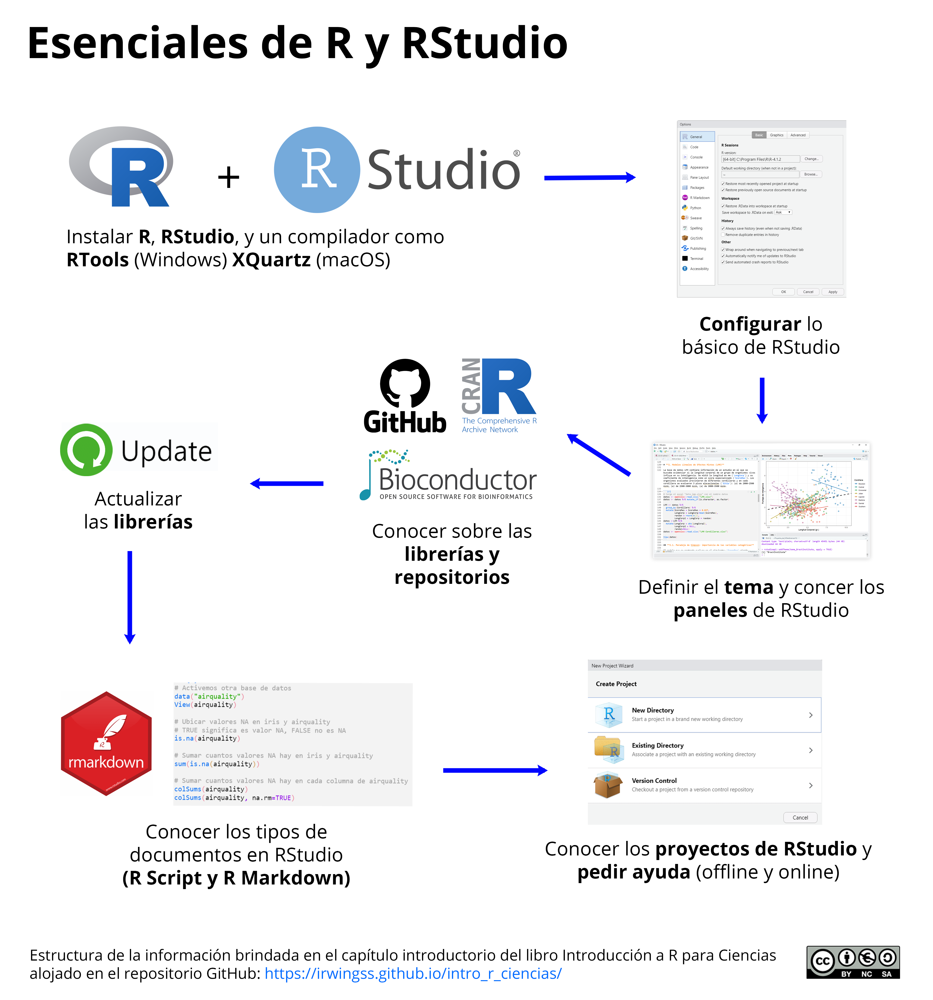
```


## Instalación de R y RStudio

Para utilizar el lenguaje de programación R (en adelante R), proponemos el uso del ambiente de desarrollo integrado [RStudio](https://www.rstudio.com/). Este programa mejorará enormemente el flujo, la velocidad y la eficiencia de trabajo con R. RStudio es más que un editor de texto que resalta la sintaxis del código de R, sino que también permite tener paneles de trabajo organizados que facilitan su uso. 

```{block2, type='rmdwarning '}
**Requerimientos mínimos del sistema para ejecutar RStudio:**

- Sistema con CPU de 64 bits. Con 32 bits es posible instalar R pero no las versiones más recientes de RStudio.
- Procesadores de 2 núcleos (equivalente a Intel® Core™ i3 o AMD Ryzen™ 3).
- 4 Gb RAM.
- Espacio en almacenamiento de 100 Gb.

**Requerimientos recomendados del sistema para ejecutar RStudio:**

- Procesadores de 4 a más núcleos (equivalente a Intel® Core™ i5 a más o AMD Ryzen™ 5 a más).
- 8 a más Gb RAM.
- Más de 100 Gb de espacio de almacenamiento.
```

Para efectos de este libro, se deberá utilizar **las versiones listadas (o posteriores)** de los siguientes programas, según el sistema operativo:

#### Para Windows: {-}

- R version 4.1.2 (2021-11-01) -- "Bird Hippie" [Descarga](https://cran.r-project.org/bin/windows/base/R-4.1.2-win.exe)
- RStudio Desktop 2021.09.1+372 [Descarga](https://download1.rstudio.org/desktop/windows/RStudio-2021.09.1-372.exe)
- Rtools4.0 [Descarga](https://cran.r-project.org/bin/windows/Rtools/rtools40v2-x86_64.exe)

#### Para macOS: {-}

- R version 4.1.2 (2021-11-01) -- "Bird Hippie" [Descarga](https://cran.r-project.org/bin/macosx/base/R-4.1.2.pkg)
- RStudio Desktop 2021.09.1+372 [Descarga](https://download1.rstudio.org/desktop/macos/RStudio-2021.09.1-372.dmg)
- XQuartz 2.8.1. [Descarga](https://github.com/XQuartz/XQuartz/releases/download/XQuartz-2.8.1/XQuartz-2.8.1.dmg)

#### Para Ubuntu/Debian: {-}

A lo largo del libro no brindamos comentarios o soporte para el uso de R o RStudio en UNIX/GNU/Linux/Ubuntu. Las principales razones son que la mayoría de usuarios que aprenden R no suelen utilizar sistemas operativos de código libre, además de que algunos paquetes han presentado problemas al ser instalados.

Primero, se debe preparar el índice de paquetes del sistema:

```
sudo apt update
```
```
sudo apt -y upgrade
```

Luego, ejecuta:
```
sudo apt -y install r-base
```

Con lo anterior ya se tiene R instalado. Más adelante, cuando se desee actualizar R, ejecuta el código:

```
sudo apt-get remove --purge r-base*
```

Luego, añadir el repositorio de CRAN:
```
sudo gedit /etc/apt/source.list
```

Para Instalar RStudio para Ubuntu 18, Ubuntu 20 o Debian 10

```
sudo apt-get install gdebi-core
wget https://download2.rstudio.org/server/bionic/amd64/rstudio-server-2021.09.2-382-amd64.deb
sudo gdebi rstudio-server-2021.09.2-382-amd64.deb
```

Los pasos aquí detallados están publicados en la [web oficial de RStudio](https://www.rstudio.com/products/rstudio/download-server/debian-ubuntu/). Otros códigos interesantes puedes hallarlos en diferentes referencias como las del [Center for Open Middleware](http://www.upm.es/sfs/Rectorado/Gabinete%20del%20Rector/Notas%20de%20Prensa/2015/05/documentos/Instrucciones%20de%20instalaci%C3%B3n%20de%20R%20y%20RStudio.pdf).

## Configuración de RStudio

La siguiente es una configuración sugerida para que RStudio sea visualizado de igual manera por todos los estudiantes que usen este libro, y se guíen mejor con la sintaxis del código, ordenamiento de paneles, codificación, idioma del texto, entre otros.

(ref:config1) Para iniciar la configuración de RStudio, clic en `tools/ Global Options`.

```{r, echo=FALSE, fig.cap='(ref:config1)', fig.align='center', out.width="100%"}
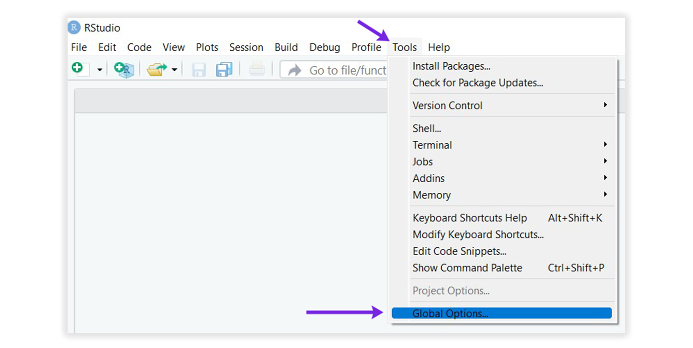
```
<br>

(ref:config2) Abrirá la ventana de configuraciones. En la pestaña General se verifica la versión de R que está ejecutando RStudio.

```{r, echo=FALSE, fig.cap='(ref:config2)', fig.align='center', out.width="100%"}
knitr::include_graphics("figs/screenshots/configRStudio-2.jpg")
```
<br>

(ref:config3) En la pestaña Code se configura la mayor cantidad de puntos necesarios para que el código sea legible. Aquí se muestra la configuración de las pestañas Editing y Display. Las dos opciones nuevas en la versión de RStudio 1.4+ son (con flechas rojas), son importantes en mejorar la lectura del código para principiantes: una permite identificar los pares de paréntesis con colores diferenciables (Rainbow parentheses en pestaña Display), y la otra es un primer intento de crear un operador pipe nativo para el código básico de R (Use native pipe operator, `|>`). Este último no lo habilitaremos para seguir usando el pipe de tidyverse `%>%`.

```{r, echo=FALSE, fig.cap='(ref:config3)', fig.align='center', out.width="100%"}
knitr::include_graphics("figs/screenshots/configRStudio-3.jpg")
```
<br>

(ref:config4) En la pestaña Saving es importante definir la codificación que usarán los archivos generados por RStudio. Se recomienda dar clic en `Change...` y luego seleccionar la codificación `UTF-8`.

```{r, echo=FALSE, fig.cap='(ref:config4)', fig.align='center', out.width="100%"}
knitr::include_graphics("figs/screenshots/configRStudio-4.jpg")
```
<br>

(ref:config6) Las pestañas Completion y Diagnóstico no se modifican mucho, pero sí es necesario mencionar que si notáse que el programa se ejecuta muy lento, se debe considerar desactivar las opciones de diagnóstico (marcadas en rojo).

```{r, echo=FALSE, fig.cap='(ref:config6)', fig.align='center', out.width="100%"}
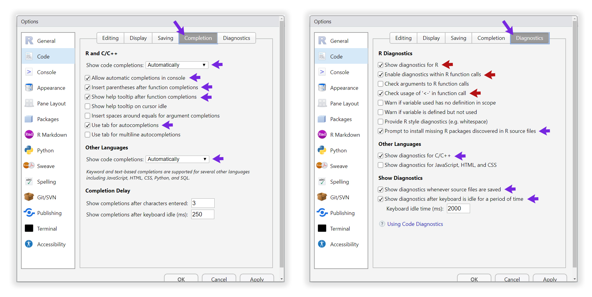
```
<br>

(ref:config7) La organización de los paneles descritos en la sección [1.4 Paneles de RStudio](#panelesRStudio) se configuran previamente en la pestaña Pane Layout. A la izquierda: la organización por defecto. A la derecha: se deberá seleccionar todas las pestañas (excepto VCS y Connections) con un check dentro del panel superior derecho. Eso hará que el panel inferior derecho cambie de nombre a "TabSet".

```{r, echo=FALSE, fig.cap='(ref:config7)', fig.align='center', out.width="100%"}
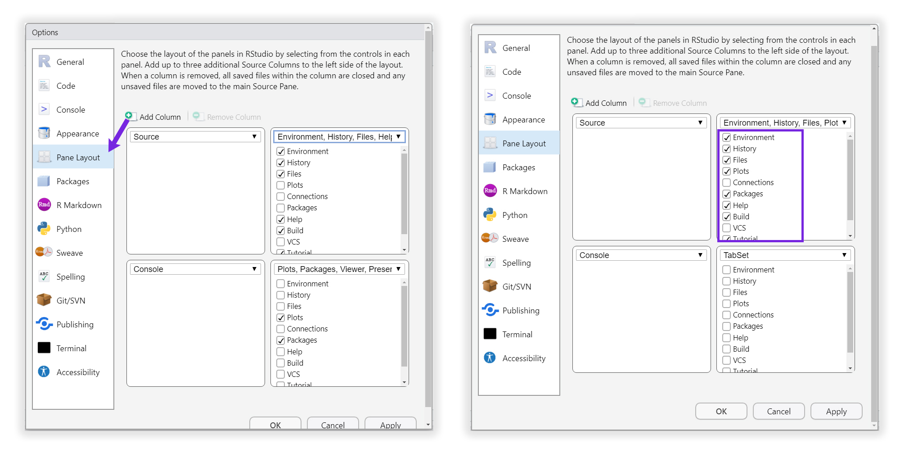
```
<br>

(ref:config8) El siguiente paso es cambiar la ubicación de TabSet haciendo clic y cambiando el panel por Console. Clic en Aplicar para definir los cambios.

```{r, echo=FALSE, fig.cap='(ref:config8)', fig.align='center', out.width="100%"}
knitr::include_graphics("figs/screenshots/configRStudio-8.jpg")
```
<br>

(ref:config9) La configuración de R Markdown es solo para evitar que se cuelgue al usar los documentos. Definir todas las casillas y selectores como se muestra a continuación en las pestañas Basic y Advanced.

```{r, echo=FALSE, fig.cap='(ref:config9)', fig.align='center', out.width="100%"}
knitr::include_graphics("figs/screenshots/configRStudio-9.jpg")
```
<br>

(ref:config10) Para trabajar correctamente con los documentos R Markdown y evitar que se cuelguen, desmarcar la casilla con flecha roja. En la pestaña Spelling, se especifica el uso del lenguaje para el texto de los documentos. Selecciona de la lista "Spanish". Clic en Aplicar para definir los cambios.

```{r, echo=FALSE, fig.cap='(ref:config10)', fig.align='center', out.width="100%"}
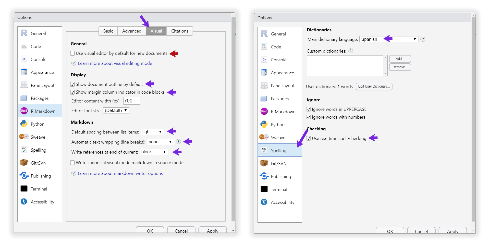
```
<br>

## Tema BrackInstitute (2022)

Este es un requerimiento especial para los estudiantes que usen este libro en las clases, en vivo o grabadas, del [Instituto de Ciencias Antonio Brack](https://www.brackinstitute.com/) a través de la plataforma educativa online [masterX](https://www.masterx.org/). Se les solicita instalen el tema de color de RStudio `BrackInstitute` para que la sintaxis del código sea del mismo color que el mostrado en clase, facilitando así su comprensión. Si eres un lector que no está llevando el programa, sientete libre instalar el tema también.

(ref:tema0) Vista previa del tema `BrackInstitute`.

```{r, echo=FALSE, fig.cap='(ref:tema0)', fig.align='center', out.width="100%"}
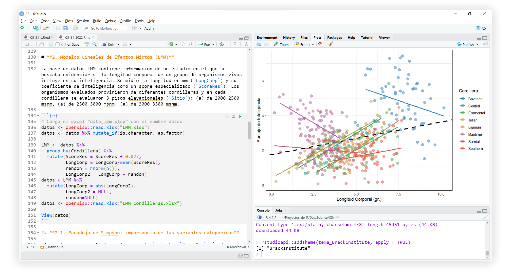
```
<br>

Para instalarlo, copia las líneas de código completas en la consola.

```{r, eval=FALSE}
install.packages("rstudioapi")
tema_BrackInstitute <- fs::path_temp("tema_BrackInstitute", ext = "tmTheme")
download.file("https://raw.githubusercontent.com/irwingss/Primolius-Theme/main/BrackInstitute.tmTheme",tema_BrackInstitute)
rstudioapi::addTheme(tema_BrackInstitute, apply = TRUE)
```

Como se muestra a continuación:

(ref:tema) Código de instalación del tema `BrackInstitute` en la consola, listo para ser ejecutado.

```{r, echo=FALSE, fig.cap='(ref:tema)', fig.align='center', out.width="100%"}
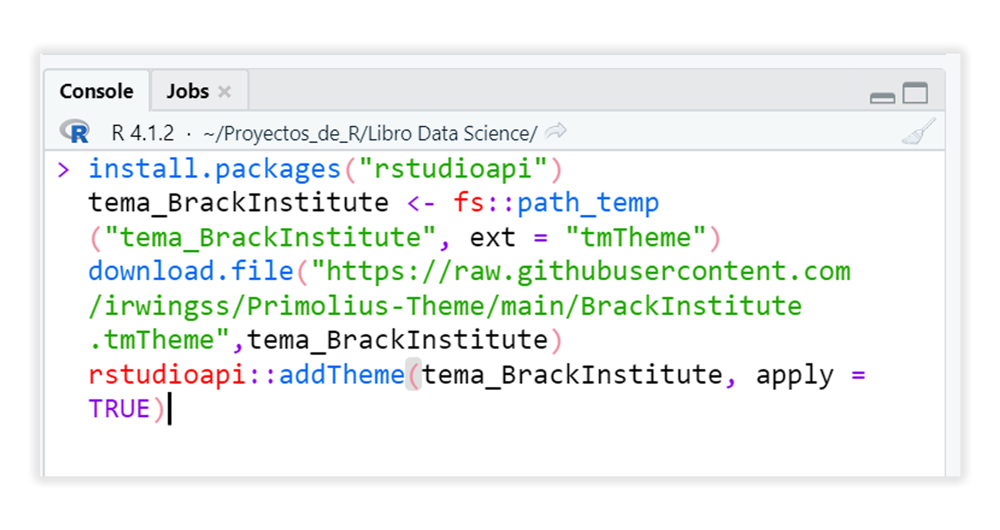
```
<br>

Finalmente, presiona `enter` para comenzar su ejecución. 

Si todo va bien, el tema cambiará automáticamente. Para más temas desarrollados para el Instituto de Ciencias Antonio Brack, visita el repositorio [Primolius-Theme](https://github.com/irwingss/Primolius-Theme) de [Irwing S. Saldaña](https://github.com/irwingss).

## Paneles de RStudio {#panelesRStudio}

Existen diversos editores de código que permiten trabajar con R, pero ninguno con la versatilidad de RStudio. El programa está dividido en paneles que uno puede reorganizar a conveniencia. Más allá de la posición o el orden de los paneles, es necesario que se sepa reconocerlos por su contenido, las pestañas que contiene, entre otros. Aquí se presentan los paneles en su posición clásica, junto con algunas barras y botones que se deben conocer al iniciar con RStudio. 

(ref:paneles1) Panel de Trabajo. Aquí aparecerán los archivos de trabajo de R, sean R script o R Markdown. Además, es donde aparecen las bases de datos cuando se pide visualizarlas en RStudio.

```{r, echo=FALSE, fig.cap='(ref:paneles1)', fig.align='center', out.width="100%"}
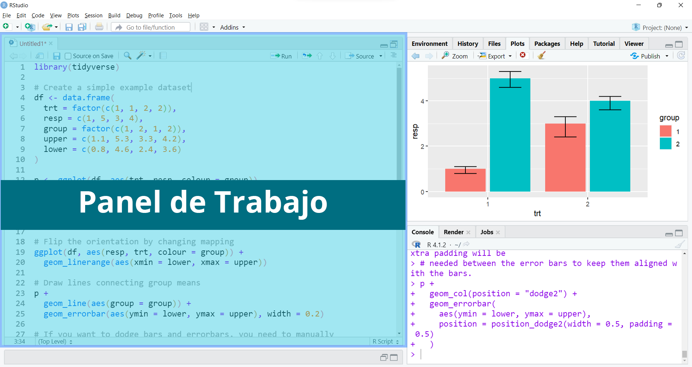
```
<br>

(ref:paneles2) Consola. Es el panel donde se imprimen los resultados textuales y numéricos junto con el código que los genera.

```{r, echo=FALSE, fig.cap='(ref:paneles2)', fig.align='center', out.width="100%"}
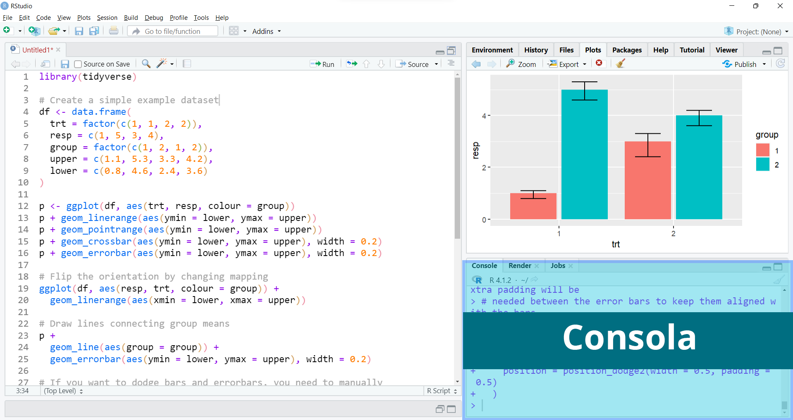
```
<br>

(ref:paneles3) Panel de pestañas: aquí encontrarás: el ambiente (Environment) donde se guardan los objetos creados o cargados en RStudio; la historia (History) de las ejecuciones realizadas durante la sesión de RStudio; archivos (Files) para visualizar los archivos de la carpeta de trabajo actual (definida como la carpeta "documentos" por defecto); la pestaña de visualización de gráficos estáticos (Plots); pestaña de  instalación y actualización de paquetes (Packages); la pestaña de ayuda (Help); y el visualizador (Viewer) de gráficos animados, gráficos 3D, objetos HTML. las conexiones (Connections) que se pueden realizar con bases de datos (Oracle, SQL, Salesforce, Spark, Hipe, entre otros); tutoriales (tutorial) precargados usando shiny para el uso básico de R y RStudio.

```{r, echo=FALSE, fig.cap='(ref:paneles3)', fig.align='center', out.width="100%"}
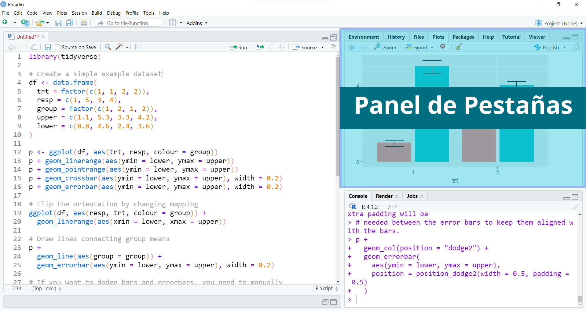
```
<br>

(ref:paneles6) Barra de opciones rápidas.

```{r, echo=FALSE, fig.cap='(ref:paneles6)', fig.align='center', out.width="100%"}
knitr::include_graphics("figs/screenshots/Slide6.PNG")
```

(ref:paneles5) Barra de menús. De las pestañas más importantes: File nos permite crear o cargar archivos; Session, definir espacio de trabajo actual; y Tools, ingresar a las configuraciones de RStudio. Usos más avanzados, como la depuración de código o el uso de versiones de control (Git), también se manejan desde las opciones de esta barra. 

```{r, echo=FALSE, fig.cap='(ref:paneles5)', fig.align='center', out.width="100%"}
knitr::include_graphics("figs/screenshots/Slide5.PNG")
```
<br>

## Librerías y Repositorios

Una de las mayores virtudes de R es la enorme comunidad de desarrollo que ha creado asombrosas funcionalidades para simplificarle el flujo de trabajo a otras personas. Estas funcionalidades en realidad son _funciones_ (para mayor detalle sobre ellas, visita la sección [2.7 Funciones](#funciones)). La estructura que almacena funciones se conoce como librería o paquete. Para poder una función en RStudio, se debe instalar previamente el paquete que la contiene. Los paquetes están publicados en repositorios. Los principales son:

- [CRAN](https://cran.r-project.org/) (de Comprehensive R Archive Network en inglés), el repositorio oficial de R. Solo los paquetes aprobados y con soporte de fallos constante son publicados aquí.

- [GitHub](https://github.com/), el repositorio más grande no oficial en el que se pueden encontrar paquetes de R. Muchos repositorios en CRAN mantienen versiones beta en GitHub para su testeo.

- [Bioconductor](https://www.bioconductor.org/), el mayor repositorio de paquetes asociados a bioinformática y ciencias afines.

(ref:paquetes) Instalación manual de paquetes.

```{r, echo=FALSE, fig.cap='(ref:paquetes)', fig.align='center', out.width="100%"}
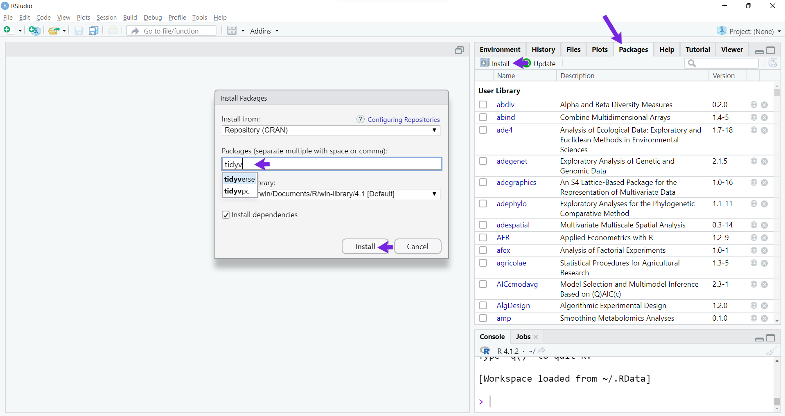
```

Si se requiere instalar paquetes de CRAN (e.g., **tidyverse**) con código, se utilizará un código similar a este:

```{r, eval=FALSE}
install.packages("tidyverse")
```

Para paquetes desde GitHub (eg., **rbrack** del repositorio de la cuenta `irwingss`), se instalará previamente el paquete de CRAN **devtools**, para luego usar una función almacenada en él `install_github()`:

```{r, eval=FALSE}
install.packages("devtools")
devtools::install_github("irwingss/rbrack")
```

## Actualización de librerías

Es importante mantener actualizada la paquetería. En los repositorios de cada paquete se suelen reportar fallos o inconsistencias que son resueltas y liberadas como una actualización. Se recomienda hacer esto al menos una vez por mes.

(ref:paquetesActualizacion) Actualización manual de paquetes de CRAN.

```{r, echo=FALSE, fig.cap='(ref:paquetesActualizacion)', fig.align='center', out.width="100%"}
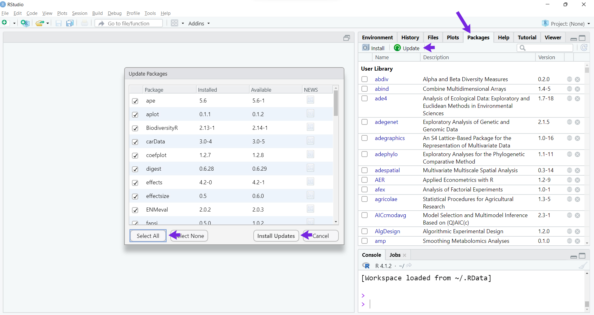
```

Los paquetes instalados desde repositorio no oficial, deberán ser actualizados "reinstalándolos" de manera forzada. Para forzar la instalación de un paquete ya instalado desde github, se usa el argumento `force=TRUE`:

```{r, eval=FALSE}
install.packages("devtools")
devtools::install_github("irwingss/rbrack", force=TRUE)
```

```{block2, type='rmdnote'}
Una vez instalados, los paquetes se almacenan en un estado no activo. Para usar sus funciones, se requiere **activar el paquete** que la contiene. 
```

Para activar un paquete utiliza la función `library()`:

```{r, eval=FALSE}
library(tidyverse)
```

Desde el momento que se ejecuta el código anterior, **tidyverse** estará activo hasta que se cierre o reinicie el programa RStudio.

```{block2, type='rmdnote'}
Otra manera de usar una función es activar su uso puntualmente, sin activar toda la librería. En este respecto, el operador `::` permite acceder a las funciones de un paquete para seleccionar una y activar su uso
```

Para acceder puntualmente a la función `bind_cols()` de la librería **dplyr**, se usa:

```{r, eval=FALSE}
dplyr::bind_cols()
```

## Tipos de documentos en RStudio

Luego de conocer los paneles de RStudio, es necesario crear los espacios donde se escribirán las órdenes a modo de código. Estos documentos, como cualquier editor de texto, se pueden guardar o compartir, por ejemplo, mediante un correo electrónico.

### R Script (.R)
 
Es el documento más simple donde puedo escribir R. Es un editor de texto como el bloc de notas de cualquier sistema operativo. No obstante, este editor lee y colorea la sintaxis especial del código de R. Esto permite identificar cada parte del código según lo que sea: una variable, una función, un número, un texto, símbolos especiales, operadores, entre otros; simplificando enormemente la lectura del código y el aprendizaje de R.

```{block2, type='rmdnote'}
Puedes crear un R script haciendo clics ([FIGURA 1.7](fig:abrirRscript)), o utilizando el atajo de teclado `Control + shift + N` o `Command + shift + N`. 
```

(ref:rscript1) Procedimiento para abrir un documento de RScript usando el menú `File/ New File/ R script`.
 
```{r abrirRscript, echo=FALSE, fig.cap='(ref:rscript1)', fig.align='center', out.width="100%"}
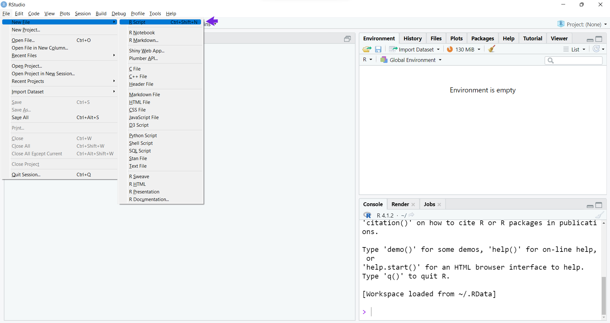
```

 
(ref:rscript2) Apariencia de un R script con código. Notar los colores diferenciales para cada parte del código.

```{r, echo=FALSE, fig.cap='(ref:rscript2)', fig.align='center', out.width="100%"}
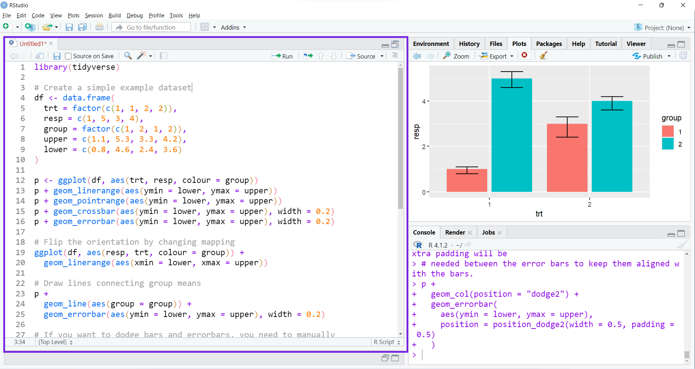
```


### R Markdown (.Rmd)

Es un formato de archivo para la creación de documentos dinámicos. Estos pueden ser: páginas web, aplicaciones **shiny**, diapositivas, o cualquier tipo de reporte que puede ser exportado en formato .docx, .pdf o .html. Utiliza la sintaxis de Markdown pero posibilitando la inclusión de "pedacitos de código", la traducción literal de code chunk. Los chunk se comportan como pequeños R scripts embebidos en el documento de texto plano escrito con sintaxis Markdown. 

Suena extremadamente complejo el decir "sintaxis Markdown", pero no lo es. Una vez uno sabe utilizar R, aprender Markdown resulta sencillo. Puedes aprender a utilizar R Markdown con el libro en línea [R Markdown: The Definitive Guide](https://bookdown.org/yihui/rmarkdown/) en su versión de 2018, o el más actualizado [R Markdown Cookbook](https://bookdown.org/yihui/rmarkdown-cookbook/) de 2020. Ambos libros han sido escritos en colaboración de Yihui Xie, uno de las mentes brillantes de RStudio y a quien le debemos el uso de documentos dinámicos en RStudio. 

No se profundizará en el uso de R Markdown, dado que no es el objetivo del programa, pero se utilizará frecuentemente durante las clases. Si eres un estudiante que no ha está llevando el programa, podrás siempre utilizar tanto R script como R Markdown para ejecutar tus códigos. Se recomienda fuertemente comenzar a utilizar este último dada la ventaja de permitir hacer anotaciones de texto plano como en cualquier editor de texto común. 

(ref:rmarkdown1) Procedimiento para abrir un documento de R Markdown usando el menú `File/ New File/ R Markdown...`.
 
```{r, echo=FALSE, fig.cap='(ref:rmarkdown1)', fig.align='center', out.width="100%"}
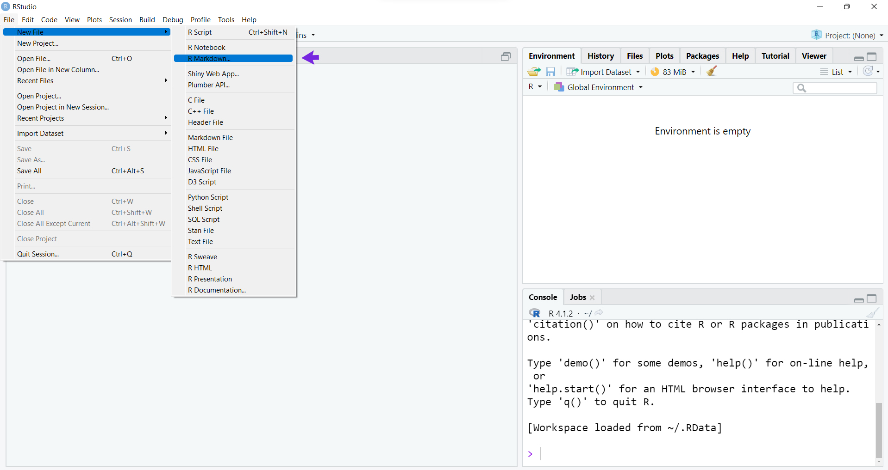
```

 
(ref:rmarkdown2) Ventana emergente para darle nombre al documento R Markdown.

```{r, echo=FALSE, fig.cap='(ref:rmarkdown2)', fig.align='center', out.width="100%"}
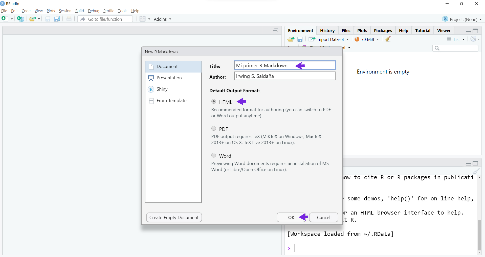
```


(ref:rmarkdown3) Aparecerá un archivo R Markdown con texto de ejemplo para que tengamos una idea de qué se puede hacer con él.
 
```{r, echo=FALSE, fig.cap='(ref:rmarkdown3)', fig.align='center', out.width="100%"}
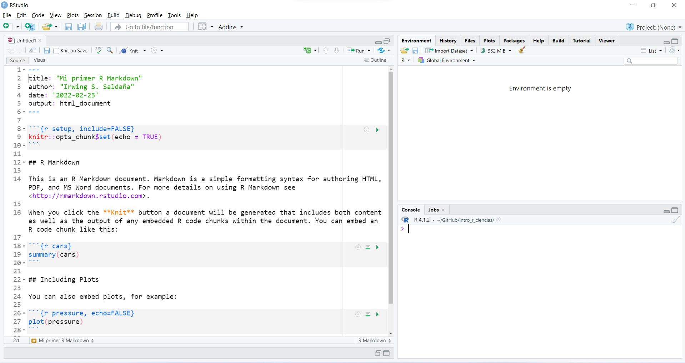
```

(ref:rmarkdown4) `knit` es una función del paquete `knitr`, desarrollado por Yihui Xie y colaboradores, para la generación de reportes dinámicos con R Markdown. Haciendo clic en el botón se despliega la lista de posibles exportaciones del documento. La exportación `Knit to HTML` produce una página web de reporte.

```{r, echo=FALSE, fig.cap='(ref:rmarkdown4)', fig.align='center', out.width="100%"}
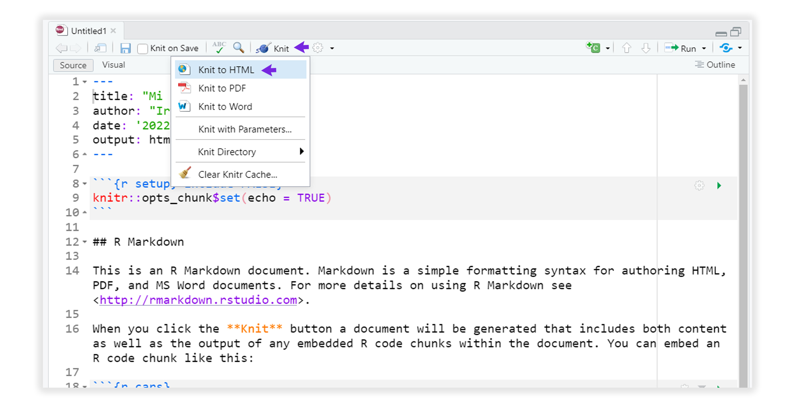
```


(ref:rmarkdown5) Tras hacer clic en `Knit to HTML`, será necesario guardar en el almacenamiento de la computadora el documento, cuya extensión es `.Rmd`.

```{r, echo=FALSE, fig.cap='(ref:rmarkdown5)', fig.align='center', out.width="100%"}
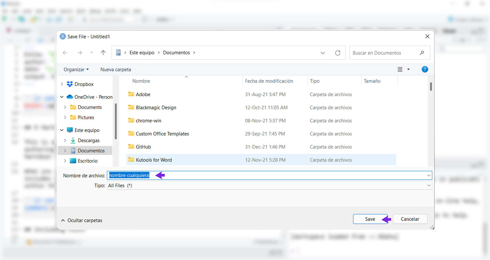
```

(ref:rmarkdown6) En la consola, o en una pestaña Render, comenzará a mostrarse la ejecución del código que `knit` desplegó para exportar el R Markdown a página web HTML.

```{r, echo=FALSE, fig.cap='(ref:rmarkdown6)', fig.align='center', out.width="100%"}
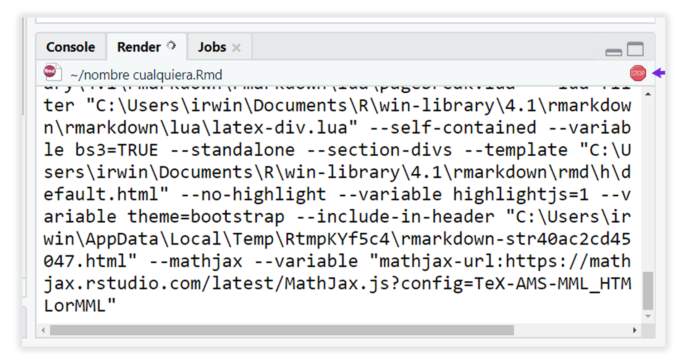
```

(ref:rmarkdown7) Vista del archivo HTML generado a partir del R Markdown de ejemplo.

```{r, echo=FALSE, fig.cap='(ref:rmarkdown7)', fig.align='center', out.width="100%"}
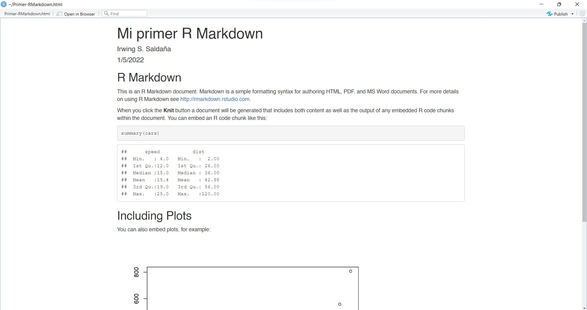
```

## Proyectos de RStudio

Este es el santo grial del uso de RStudio para crear una diversidad de repositorios: de trabajo, [colaboraciones](https://medium.com/@jonathanmines/the-ultimate-github-collaboration-guide-df816e98fb67), [diapositivas](https://bookdown.org/yihui/rmarkdown/xaringan.html), [páginas web](https://rmarkdown.rstudio.com/lesson-13.html), [blogs](https://bookdown.org/yihui/blogdown/), [libros](https://bookdown.org/), entre otros. Para poder usar un proyecto de RStudio con dichos propósitos, se necesita aprender a usar las versiones de control de proyectos con [Git](https://happygitwithr.com/install-git.html) y [Shell](https://cfss.uchicago.edu/setup/shell/). Puedes iniciar en este tema con una genial presentación de su uso, elaborado por [University of Zurich](https://www.geo.uzh.ch/microsite/reproducible_research/post/rr-rstudio-git/). 

Este apartado solo se centrará en el uso de proyectos para trabajos locales. Una vez se domine este uso, será más sencillo entender cómo elaborar otras cosas más complejas.

Aquí se muestran los pasos para crear un proyecto local:

(ref:proyecto1) Para crear un proyecto local, ir a menu `File/ New Project...`. 

```{r, echo=FALSE, fig.cap='(ref:proyecto1)', fig.align='center', out.width="100%"}
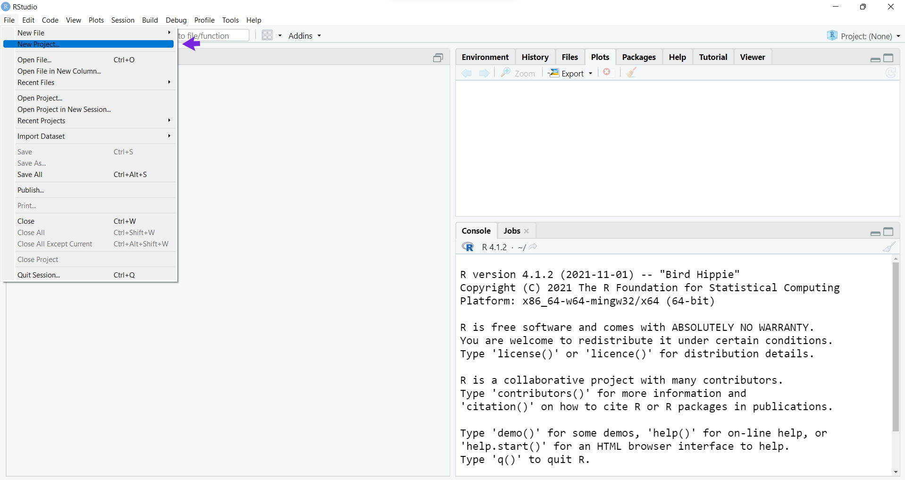
```

(ref:proyecto2) Para efectos de este libro, selecciona la primera opción. Clic en `New Directory` para crear en el almacenamiento de tu computador una carpeta nueva donde se almacenará todo los respecto a este proyecto. `Existing Directory` solo se usará cuando ya se ha creado de antemano una carpeta donde se quiere almacenar el proyecto. Para versiones de control con Git y GitHub, el proceso se inicia con `Version Control`, para crear la carpeta de trabajo (tal como las anteriores opciones), pero el proyecto estará _casi_ listo para hacer _commit_ y publicar los cambios en GitHub. 

```{r, echo=FALSE, fig.cap='(ref:proyecto2)', fig.align='center', out.width="100%"}
knitr::include_graphics("figs/screenshots/proyectos2.jpg")
```

(ref:proyecto3) En `Directory name:` escribe el nombre del proyecto, mismo que también tendrá la nueva carpeta de trabajo que se creará en tu computador. En el botón `Browse...`, podrás ubicar una carpeta _madre_ donde irás creando proyectos para mantenerlos todos ordenados y accesibles. Puede ser una subcarpeta dentro de documentos, con algún nombre genérico como "proyectos", "proyectos de R", entre otros. Finalmente, clic en `Create Project`.

```{r, echo=FALSE, fig.cap='(ref:proyecto3)', fig.align='center', out.width="100%"}
knitr::include_graphics("figs/screenshots/proyectos3.jpg")
```

(ref:proyecto4) Se abrirá una nueva sesión con título idéntico a la carpeta de proyecto creada (aquí "Investigación A"). Nótese el ambiente (environment) en blanco. Todas las variables y funciones que se creen o carguen en el proyecto permanecerán en este ambiente específico del proyecto.  

```{r, echo=FALSE, fig.cap='(ref:proyecto4)', fig.align='center', out.width="100%"}
knitr::include_graphics("figs/screenshots/proyectos4.jpg")
```

(ref:proyecto5) En la pestaña de `Files` se verá el contenido de todo lo que copiemos dentro de la carpeta del proyecto. Puedes acceder a la carpeta de trabajo haciendo clic en `More/ Show Folder in New Windows`. Allí podrás pegar archivos o documentos que necesites cargar posteriormente en tu proyecto.

```{r, echo=FALSE, fig.cap='(ref:proyecto5)', fig.align='center', out.width="100%"}
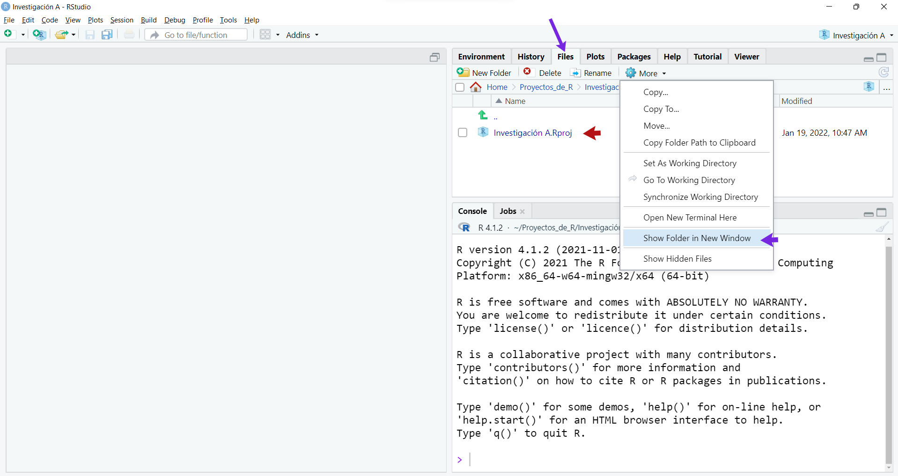
```

(ref:proyecto6) Para crear un nuevo proyecto, abrir uno existente  o cerrar el proyecto actual (flecha roja), existe el menú de acceso rápido que tiene el mismo nombre que tu proyecto actual. Para ver la dirección de la carpeta de trabajo en consola, ejecuta la función `getwd()`.

```{r, echo=FALSE, fig.cap='(ref:proyecto6)', fig.align='center', out.width="100%"}
knitr::include_graphics("figs/screenshots/proyectos6.jpg")
```

(ref:proyecto7) En tu computador, encontrarás creada la carpeta del proyecto, en la dirección que especificaste, donde podrás pegar los archivos que aparecerán en la pestaña de Files del Panel de Ambiente del proyecto.

```{r, echo=FALSE, fig.cap='(ref:proyecto7)', fig.align='center', out.width="100%"}
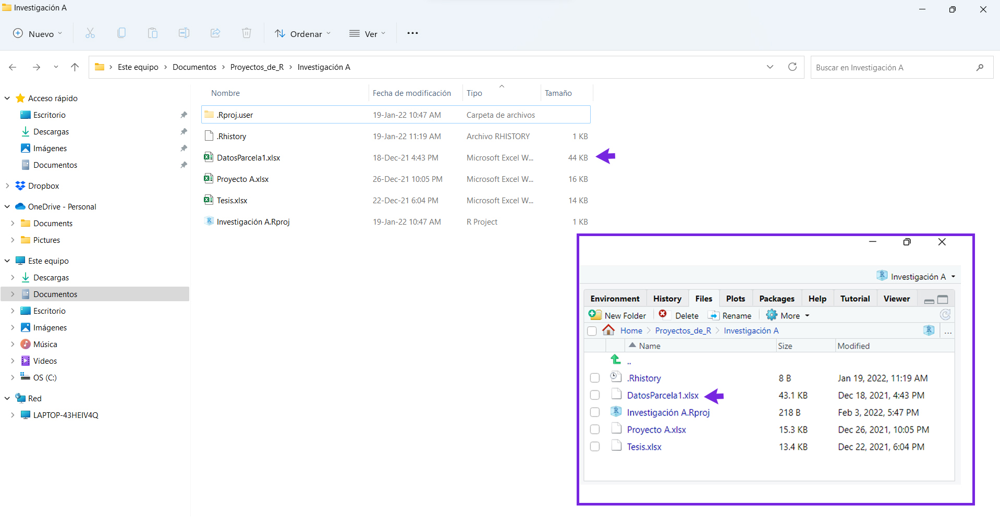
```

```{block2, type='rmdnote'}
- Para ver la dirección de la carpeta de trabajo en consola, ejecuta la función `getwd()`.

- Si necesitas cambiar manualmente tu proyecto a otro directorio (carpeta) de trabajo, ejecuta la función `setwd()` definiendo dentro de ella y entre comillas la nueva dirección deseada. Por ejemplo:
<center>`setwd("C:/Users/irwin/Documents/Otra_Carpeta/Subcarpeta B")`</center>

- No olvides las comillas al inicio y final de la dirección, ni que los slash usados son forwardslash (hacia delante) `/`, no backslash (hacia atrás) `\`.
```

## Pedir ayuda

Pedir ayuda sin internet es algo posible en RStudio. Todas las librerías instaladas contienen información de respaldo sobre el uso de cada función que almacenan. 

Para acceder a ella, se debe acceder a la pestaña Help. 

(ref:help1) Accediendo a la pestaña Help para buscar ayuda sobre la función `mean()`. Nótese que solo se busca el nombre de la función sin paréntesis. 

```{r, echo=FALSE, fig.cap='(ref:help1)', fig.align='center', out.width="100%"}
knitr::include_graphics("figs/screenshots/help1.jpg")
```

(ref:help2) Detalle de la ayuda de la función `mean()`. Es muy útil revisar la sección Arguments donde se describen los argumentos, además los ejemplos de uso.

```{r, echo=FALSE, fig.cap='(ref:help2)', fig.align='center', out.width="100%"}
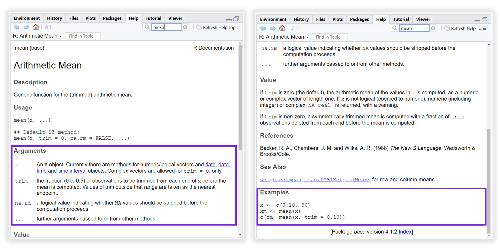
```


```{block2, type='rmdnote'}
- Es posible **pedir ayuda con código**. Ejecutando la función `help()` conteniendo el nombre de la _función_ que se desea buscar, abrirá automáticamente la página de ayuda en la pestaña Help. Por ejemplo:`help(varimax)`.

- Otra forma de obtener el mismo resultado es usando el símbolo `?`. Por ejemplo: `?varimax`.

- Si se necesita buscar un _término_, no una función, se usaría el simbolo doble `??` antes del término a buscar. Esta búsqueda es más lenta porque es más profunda y nos da todas las funciones donde se use dicho término. Por ejemplo, para buscar en todos archivos de ayuda de R el término deviance: `??deviance`.
```

Para pedir ayuda en internet, se recomienda el uso del buscador exclusivo de temas en R conocido como [rseek](https://rseek.org/). 

(ref:help3) Búsqueda de ayuda para la función `mean()` en rseek. Puedes acceder directamente a la viñeta (PDF o web) del uso de la función (que es la misma información que en la búsqueda en RStudio), documentación, funciones asociadas, paquetes populares que usen mean, wikipedia, blogs como [R-Bloggers](https://www.r-bloggers.com/) donde expliquen su uso, _Issues_ que son problemas reportados para la función, o paquetes que contengan una función con el mismo nombre. 

```{r, echo=FALSE, fig.cap='(ref:help3)', fig.align='center', out.width="100%"}
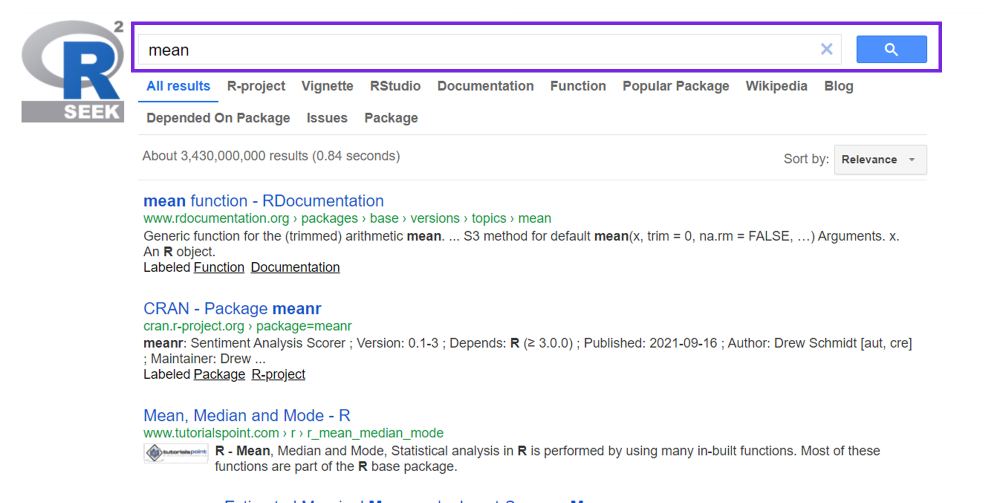
```
