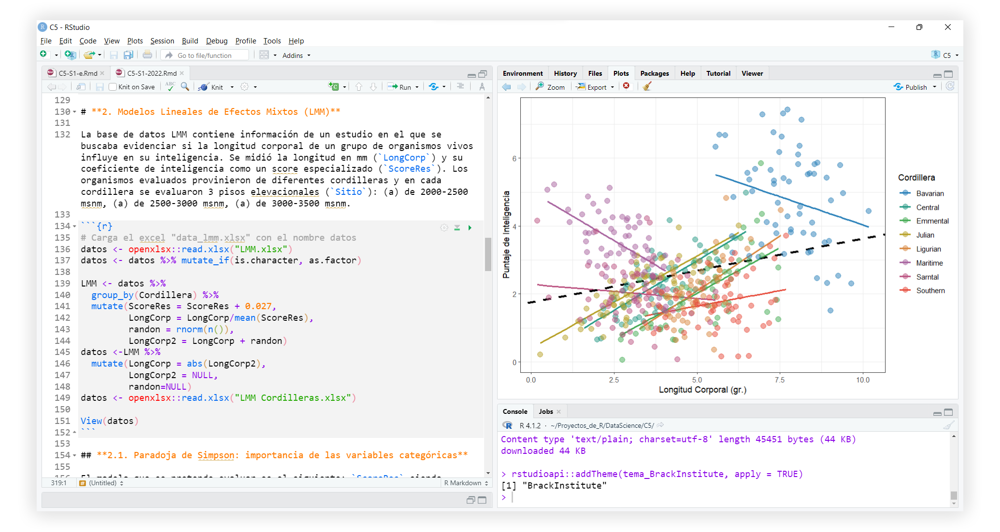

# **Primer contacto con R** {#rbasico}

Este capítulo se centra en el manejo y comprensión del lenguaje de programación R (en adelante: "R") en nivel introductorio. Se asume que el lector tiene instalados y configurados los programas R, RStudio y algún otro programa de soporte para el manejo de paquetes. Si no cuentas con ninguno en tu computadora, visita el capítulo [1 Esenciales de R y RStudio](#esencialesRRStudio).

Una ventaja de los lenguajes de programación es que permiten al usuario definir una secuencia de órdenes (comandos) adaptadas a los requerimientos analíticos que tenga. El flujo de trabajo completo, el paso a paso, queda escrito en el código. Este puede ser compartido con colegas en trabajos colaborativos. 

Antes de aprender sobre los métodos estadísticos de análisis que se revisarán en este libro, se necesita "hablar" correctamente el lenguaje R. Aprenderás a trabajar con el código básico en R, a crear variables para almacenar información, a crear funciones para agilizar el flujo de trabajo, a utilizar `tidyverse` para el manejo y limpieza de bases de datos, entre otros códigos útiles para inicar con R. 

La forma simplificada de cómo funciona R se resume en escribir una orden, presionar "algo" para que la computadora comience a procesar la orden, y luego recibir un resultado textual o gráfico. Básicamente lo que hace cualquier otro lenguaje de programación. 

No obstante, R es considerada una de los mejores lenguajes informáticos si nuestra orientación es más la investigación científica que el desarrollo informático. Otros lenguajes informáticos populares entre científicos son Python, MATLAB, C, C++, JavaScript, SQL, Scala, Julia, SAS, pero ninguno esta tan orientado al desarrollo estadístico como R.

(ref:vistprevRStudio) Ejemplo de uso de RStudio en el análisis estadístico.

```{r, echo=FALSE, fig.cap='(ref:vistprevRStudio)', fig.align='center', out.width="100%"}

```
<br>

R es considerada como una _calculadora con esteroides_ dado que puedes aplicar matemáticas con él; aquella ciencia sobre la que se cimentan casi todas las demás. Si puedes hacer ello, tienes las puertas abiertas a aplicar análisis estadísticos, generar gráficos y todo lo que te imagines. Y pues sí, también hay cosas algo bizarras en R, como poder crear tu propio [calendario](https://r-coder.com/calendarios-r/) o usar [gatitos](https://github.com/R-CoderDotCom/ggcats) en un gráfico de dispersión de puntos.

A diferencia de los lenguajes humanos (idiomas), un lenguaje de programación debe estar escrito a la perfección. No hay espacio para una coma mal puesta, un paréntesis olvidado, o un nombre errado. La computadora solo ejecutará la orden si todo está escrito exactamente, tal y como debe ser. Todos los ejemplos de este libro pueden ser ejecutados correctamente si se escriben como es mostrado, y si instalaste todo lo necesario para trabajar (revisa las secciones [Prerrequisitos](#prerrequisitos) y [1 Esenciales de R y RStudio](#esencialesRRStudio). 

## Ejecutar código

¿Alguna vez hiciste un histograma de frecuencias?. Hacer uno de manera exploratoria es muy sencillo en R. El siguiente código hará dos cosas en un solo paso: 

1. Creará un conjunto de 10,000 datos aleatorios que siguen en la distribución normal.
2. Generará el gráfico del histograma de frecuencias utilizando el conjunto previamente creado. 

Por ahora no se ahondará en el detalle de qué cosa es `rnorm()` o `hist()`.

```{r, out.width="100%"}
hist(rnorm(10000))
```

Para replicarlo, es necesario escribir el código exacto, para luego dar la orden, es decir, ejecutar el código. La ejecución se hace presionando en el teclado de tu computador `control + enter` o `command + enter` (usuarios macOS).

```{block2, type='rmdnote'}
Existen otros atajos de teclado para ejecuciones especiales.

- Ejecutar todas las líneas de código del script: `control (o command) + shift + enter`.
- Ejecutar desde el inicio del script hasta la línea actual: `control (o command) + Alt + B`.
- Ejecutar desde la línea actual hasta el final del script: `control (o command) + Alt + E`.

No obstante, no son necesarias. Es suficiente con conocer la ejecución básica, dado que para ejecutar varias líneas de código a la vez solo se deben seleccionar las requeridas y ejecutar con  `control + enter` o `command + enter`.
```

Una pregunta que siempre genera confusión es la presencia de unos corchetes `[1]` en los resultados vistos tanto en consola como en este libro. Esto no es parte de un resultado por si mismo, es la posición del elemento mostrado justo a la derecha del corchete. 

Si se ejecuta el símbolo `:` entre dos números, R generará el rango de valores enteros entre dichos números, incluyéndolos.

```{r}
1:100
```

El resultado muestra los confusos `[]` a la izquierda del primer elemento de cada fila del conjunto de datos resultante, indicando su posición dentro de la secuencia de elementos.

## R como calculadora

Como ya se había mencionado antes, R nos permite operar con código. La cosa más sencilla para hacer en R es sumar. 

```{r}
10 + 10
```


```{block2, type='rstudio-tip'}
En adelante se visualizará tanto el código a ejecutar (primera línea del ejemplo de suma aquí propuesto) como su resultado textual, mismo que obtendrás en la consola de RStudio (segunda línea del ejemplo) si sigues los pasos de cada ejemplo o ejercicio.
```

<br>

```{r echo=FALSE, message=FALSE, warning=FALSE}
openxlsx::read.xlsx("bases/tabla1.xlsx")%>% 
   kable(format = "pandoc", caption = 'Operaciones (símbolos) aritméticas en R')
```

### Funciones matemáticas

Operaciones más complejas necesitan el uso de funciones. Estas son "secuencias de ordenes empaquetadas con un nombre pequeño y recordable" — la información sobre las funciones será desarrollada más adelante ([2.6 Funciones](#funciones) y [6.2 Creación de Funciones](#creacion-fun)). En la siguiente tabla se presentan las funciones matemáticas más comunes en R: 

```{r, echo=FALSE}
openxlsx::read.xlsx("bases/tabla2.xlsx")%>% 
  kable(format = "pandoc", caption = 'Operaciones matemáticas en R. Estos procedimientos matemáticos vienen predefinidos como ordenes denominadas "Funciones".')
```

## Operadores lógicos y relacionales

Además de poder operar matemáticamente dos objetos, los lenguajes de programación como R usan condiciones lógicas para definir estados de verdadero (`TRUE`) o falso (`FALSE`). Existen dos tipos de operadores en R para de definir un estado lógico:

Los operadores relacionales permiten comparar dos objetos y definir si la condición solicitada es verdadera o falsa. Por ejemplo: al preguntar a R si 10 es mayor que 9, definirá la condición lógica como verdadera. Este tipo de comparaciones pueden ser mayor, menor, mayor igual, menor igual, igual, no es igual o negación de un valor.

Los operadores lógicos permiten definir una condición lógica en base a los resultados de dos comparativas relacionales. Por ejemplo, si se desea filtrar las filas de una tabla para que se cumpla la _condición 1_: valores mayores a 10 en la columna A _y_ la _condición 2_: valores menores que 5 en la columna B, es preciso que ambas condiciones se cumplan para que una fila se muestre en el resultado final, gracias al operador _y_. Si la condición usa el operador _o_, tanto se cumpla una u otra condición, la fila se mostrará en el filtrado final.

En la siguiente tabla se muestran los operadores lógicos (últimos dos) y relacionales.

```{r, echo=FALSE}
openxlsx::read.xlsx("bases/tabla3.xlsx")%>% 
  kable(format = "pandoc", caption = 'Operadores relacionales y lógicos en R, modos de uso y resultado lógico esperado (Verdadero o Falso).')
```

## Comentar el código

Una forma de asegurar que en el futuro el código escrito sea entendible, incluso por nosotros mismos, es comentándolo. Dejar comentarios nos ayudará a recordar la intención con la que se escribió una sección determinada de los comandos.

Para comentar en R, se requiere colocar el símbolo `#` a la izquierda del texto a ser considerado comentario. 

```{r}
# Esta es una suma 
2 + 2 

10 * 2 # + 3029
```

Como queda en evidencia, no importa si el comentario está en solitario en una línea de código, o si está a la derecha de algo que sí se quiere ejecutar. Esto no afecta el resultado de la operación.

## Creación de variables

Las variables son espacios virtuales, que puede contener de elementos o estar vacíos. Imagina que en una tabla de datos es un objeto "contenedor de mediciones" de un trabajo de investigación. Dicha tabla puede ser considerada una variable u objeto en R. Más adelante se hablará sobre los tipos de variables que existen en R.

Una forma sencilla de comenzar con variables es guardar un valor numérica en la memoria de trabajo de RStudio, también llamado ambiente (pestaña _Environment_). En este sentido, se necesita _asignar_ el contenido a un nombre para que RStudio lo "recuerde", haciendo uso de un operador de asignación `<-`. Para crear una variable llamada NUM conteniendo el número 2022.

```{r}
NUM <- 2022
```

Si se desea ver el contenido de una variable previamente guardada en el ambiente, basta con ejecutar el nombre d ela variable:

```{r}
NUM
```

o usar la función `print()` para imprimirla en la consola:

```{r}
print(NUM)
```

Una versión frecuentemente usada en ejemplos de R, involucra colocar a la asignación entre paréntesis para que hacer dos cosas a la vez: guardar la variable en el ambiente y mostrar su contenido en la consola.

```{r}
(NUM <- 2022)
```

Existe la posibilidad de asignar con un operador de asignación inverso `->`. Toma en cuenta qué debe ir en la cola (contenido) y en la cabeza (nombre) del operador. En otras palabras, la "flecha" que se forma con este operador siempre apunta al futuro nombre de la variable. Recuerda, la variable no existe hasta que no se ejecute y aparezca dicho nombre en el ambiente de RStudio.

```{r}
# Operador de asignación inverso
2022 -> NUM
```

El símbolo `=` también funciona, pero, por convención, este no se debe usar para crear variables. Se usará dentro de las funciones para "asignar" contenido a los argumentos de las mismas (se explicará a continuación).

```{r}
# Mal uso del símbolo =
NUM = 2022

# Buen uso del símbolo = : siempre dentro de una función.
# Calcular el logaritmo en base 2 de 10
bs <- 2 + 8
log(10, base = bs)
```


```{block2, type='rstudio-tip'}
Ciertamente, en el ejemplo anterior no fue esencial guardar la variable `bs` en el ambiente para su uso posterior dentro de `log()`. Sabemos de antemano que la suma es `10`. No obstante, este ejemplo nos da idea de como aplicar el guardar un resultado para usarlo luego en ejercicios más complejos.
```

No es posible continuar hablando de variables sin antes hacer una introducción a las funciones en R. 

## Funciones {#funciones}

Se puede idealizar una función como una secuencia de órdenes (líneas de código) que tienen como objetivo aplicarle un procedimiento (gráfico, estadístico, de modificación o transformación, entre otros) a un objeto de entrada (input) para generar un resultado (ouput). Dichas líneas de código están empaquetadas y almacenadas con un nombre. 

Reconocer una función en R es tarea sencilla, siempre será un nombre seguido de paréntesis. Por ejemplo, la función para calcular la desviación estándar de un conjunto de datos es `sd()`, que proviene del inglés _standard deviation_. Dentro de los paréntesis se deben colocar los argumentos de la función. El argumento más sencillo que algunas funciones necesitan es un conjunto de datos, y es justamente lo único que necesita `sd()`.

```{r}
# Para crear un conjunto de datos en R se usa la función c()
x <- c(7,9,3,4,5,3,7,8)

# Usando sd() para hallar la desviación estándar de x
sd(x)
```

Si se ejecuta únicamente el nombre de una función existente en RStudio, en la consola se mostrará el contenido de la misma, la secuencia de órdenes que le dan forma a la función. Ejecuta el `sd` para ver su contenido:

```{r}
sd
```

La secuencia de órdenes dentro de `sd` es corta. Básicamente utiliza la función `sqrt()` para sacarle la raíz cuadrada a la función `var()`, esta última calcula la varianza de un conjunto de datos. La estructura del código es propiamente la fórmula matemática para el cálculo de la desviación estándar. Aunque, a decir verdades, el código luce más complejo, y es debido a que aquí la función `var()` contiene argumentos condicionales para pedir que evalúe si el objeto `x` es correcto para la función, o si se necesita un cambio antes de procesar`x` en `sd()`. Pierde cuidado si no se entiende mucho por ahora, no es necesario comprender las funciones a este nivel al iniciar con R.

## Funciones básica útiles

En gran medida, las primeras etapas del aprendizaje de R involucran _entender_, siendo prioritario comprender qué dice un código y cómo se interpreta, más allá de escribirlo de memoria. En este sentido, la mayoría de funciones están nombradas de tal manera que indican para qué se pueden usar. Un dominio básico del idioma inglés será de mucha utilidad, principalmente porque casi todas las funciones de R están nombradas en inglés.

Para facilitar esta primera etapa de aprendizaje, aquí se muestra una lista de funciones básica útiles, tanto a nivel de programación como de análisis de datos, que serán clave para iniciar con R.

Los ejemplos de uso de la tabla son aplicables, siempre y cuando se ejecute antes el siguiente código para activar la base de datos `iris`, y crear los vectores `x`, `y`, y `letras`.

```{r, eval=FALSE}
data("iris")
set.seed(123)
x <- rnorm(30,2,1)
y <- rnorm(30,5,3)*x/2
letras <- c("A", "B", "A", "A")
```

```{r, echo=FALSE}
openxlsx::read.xlsx("bases/tabla4.xlsx")%>% 
  kable(format = "pandoc", position = "h!", caption = 'Cincuenta funciones básicas útiles en R.')
```

