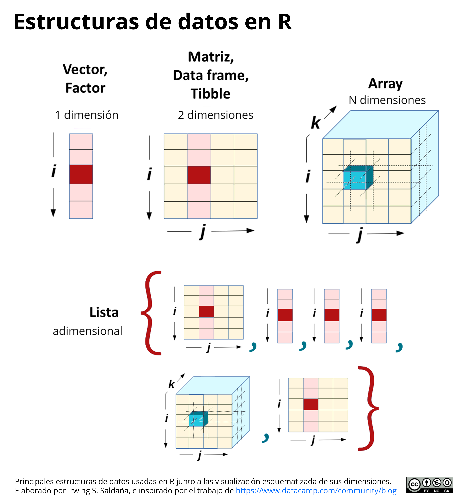

# **Estructuras de datos** {#estructurasdatos}

La sección básica de R, introdujo la terminología de variables y funciones en lo que respecta a la sintaxis del código en R. En este capítulo, revisaremos todo lo que se debe conocer para manejar estructuras de datos diversas. Estos son los insumos esenciales que ingresarán más adelante en las funciones para poder procesar datos, analizarlos o convertirlos en impresionantes gráficos estadísticos. La teoría sobre las variables es la base de todo lo que desarrollarás en R.

## Clasificación de variables

Toda variable cuenta con dos atributos: clase y estructura. Para entender cómo se almacenan los datos en R, se necesita conocerlas a detalle.

(ref:gatocaja) Analogía del gato en la caja para entender a las variables. Aquí, el gato es el contenido; la caja, la estructura. Esta "variable" podría ser considerada de la clase "contenedora de gatos" y de estructura "cúbica". De igual manera, en R reconoceremos variables contenedoras de números, de caracteres, de valores lógicos, mismos que podrán estar ordenados en estructuras de una, dos, tres o N dimensiones.  

```{r, echo=FALSE, fig.cap='(ref:gatocaja)', fig.align='center', out.width="100%"}

```
<br>


### Clases atómicas

Según su contenido, en R existen seis clases básicas (o atómicas) de variables:

- Clase lógica: identificado con el nombre `logical`
- Clase caracter o texto: identificado con el nombre `character`
- Clase número con decimales: conocidos como *doubles*, identificado con el nombre `numeric`
- Clase número entero: identificado con el nombre `integer`
- Clase número complejo: identificado con el nombre `complex`
- Clase crudo o en bits: identificado con el nombre `raw`

De estos, los últimos tres no serán utilizando a lo largo de este libro. Quizá surja la pregunta de por qué no usar números enteros. En realidad una variable del tipo `numeric` ya incluye enteros y con decimales (es decir, todos los números reales). Para efectos de una gran cantidad de funciones estadísticas, en R no es relevante brindarle números enteros como `integer`, o diferenciarlos de `numeric`.

### Estructuras de datos 

Según su estructura, las variables pueden tener una forma de almacenamiento con diferente dimensionalidad. 

- La estructura más básica de R es el vector, con una sola dimensión. 
- El vector se convierte en un factor si es que contiene información categorizada, y sigue teniendo una dimensión. 
- Si vectores se colocan verticalmente, y se apilan lado a lado, se convierten en una estructura de dos dimensiones. Dependiendo de sus características estas pueden ser: 
matrices, data frames o tibbles.
- Se puede considerar a los arrays como arreglos multidimensionales de vectores.
- Finalmente, las _listas_ son estructuras de datos básicas. No se consideran dimensionales dado que almacena a otras estructuras de datos secuencialmente. Una lista puede albergar vectores, factores, matrices, data frames, tibbles, arrays, incluso otras listas.

(ref:strdatos1) Estructuras informáticas para almacenar de datos en el lenguaje R.

```{r, echo=FALSE, fig.cap='(ref:strdatos1)', fig.align='center', out.width="100%"}

```

## Vectores

R es un lenguaje basado en vectores. La estructura de almacenamiento de datos más básica es el vector. Un vector contiene elementos, que pueden ser números, textos, valores lógicos, y de cualquier clase atómica. No obstante, solamente puede almacenar elementos de una única clase atómica a la vez. Solo números, solo texto, solo valores lógicos.

### Crear un vector

Para crear un vector, se utiliza la función `c()` donde especifíco los elementos directamente:

```{r}
# Vector numérico
numeros <- c(1,2,3,4,5,6)
numeros
```

Un operador de gran utilidad es `:` que permite crear rangos de números enteros.

```{r}
1:6
```

Además de `c()`, existe la función `vector()` para crear vectores vacíos de una longitud y clase atómica determinado.

```{r}
# Vector lógico de longitud (length) 10
vLog <- vector("logical", length=10)
vLog

# Vector de caracteres de longitud (length) 15
vCha <- vector("character", length=15)
vCha

# Vector de números de longitud (length) 20
vNum <- vector("numeric", length=20)
vNum
```

La razón para usar `vector()` es para crear un *contenido vacío* de una longitud determinada, el cual podremos ir llenando con los resultados de un loop. Nos adelantaremos un poco con el código un tanto más avanzado, pero verás el uso de esta función.

```{r}
vNum <- vector("numeric", length=6)
vNum

# Loop donde a una secuencia de números del 1 al 6
# se le multiplica a cada uno por 100
for (i in 1:6){
  vNum[i] <- i * 100
}

# Vector ya rellenado por el loop
vNum
```

### Vectores de secuencias y repeticiones

Existen formas especiales de crear vectores implica el uso de `seq()` para crear secuencias numéricas, o `rep()` para repetir de algún valor una determinada cantidad de veces.

Para crear una secuencia del 10 al 100 cada 5 elementos, se usa el argument `by =` dentro de `seq()`

```{r}
seq(10, 100, by=5)
```

Para crear una secuencia del 36 números entre 10 y 100, se usa el argument `length =` dentro de `seq()`

```{r}
seq(10, 100, length=36)
```

Las repeticiones implica definir dos argumentos: lo que se repetirá, y la cantidad de veces. Para repetir el carácter `América` 10 veces, se usa:

```{r}
rep("América", 10)
```

### Funciones útiles para vectores

Resulta útil conocer algunas de las funciones básicas en R para trabajar con vector.

```{r echo=FALSE, message=FALSE, warning=FALSE}
openxlsx::read.xlsx("bases/tabla5.xlsx")%>% 
  kable(format = "pandoc", caption = 'Operaciones (símbolos) aritméticas en R')
```

### Operaciones numéricas con vectores

Las operaciones matemáticas que involucran vectores se aplican con lo que se denomina *element-wise*, que se traduce como _**elemento a elemento**_.

```{r}
vector2 <- 10:20
vector2 + 5
```

En la operación anterior, se le sumó 5 unidades a cada elemento de `vector2`. Si se **operan dos vectores de igual longitud**, los elementos del primer vector se van operando uno por uno contra el elemento correspondiente en la posición homóloga del segundo vector.

```{r}
vector3 <- 0:10
vector2 * vector3
```

Si se **operan dos vectores de diferente longitud** de elementos, el resultado tendrá la longitud del mayor, y el menor se irá operando elemento a elemento, y se *recliclará* desde su primer elemento para aplicarse hasta culminar de operar todo.

```{r}
vector4 <- 1:3

# Revisar el contenido de los vectores
vector2
vector4

# Producto de dos vectores de longitud desigual
vector2 * vector4
```

### Valores perdidos en vectores

Estos elementos son los tipicos *NA* que aparecen cuando no hay un dato disponible en un conjunto de datos. Si operamos un vector con funciones estadísticas, como `mean()` o `sd()`, el resultado se verá afectado por la presencia del NA, y este impedirá que se genere el resultado correcto. Para evitarlo, es importante incorporar el argumento `na.rm = TRUE` para *remover* los NA de un conjunto de datos y operar sin ellos.

```{r}
vectorNA <- c(10, 20, NA, 40, 50)

# Operar directo (errado)
mean(vectorNA)

# Operar incluyendo el argumento para remover NAs
mean(vectorNA, na.rm = TRUE)
```

### Indexación de vectores

Indexar significa ubicar posiciones. Cada elemento dentro del vector tiene una posición única. Se puede **extraer el contenido de una posición única definida** dentro de un vector utilizando el operador `[]`. Utilicemos el objeto `vectorNA` creado en la sección anterior:

```{r}
vectorNA[1]

vectorNA[3]

vectorNA[5]
```

Para **extraer más de un elemento a la vez**, en lugar de colocar una sola posición dentro de `[]`, se coloca un vector con las posiciones. 

```{r}
vectorNA[c(1,3)]

vectorNA[c(1,3,5)]
```

Otro modo es crear un vector de índice, **index**, que contenga las posiciones de interés:

```{r}
index <- c(1,3,5)
vectorNA[index]
```

**Indexar con operaciones lógicas** también es posible. El operador `[]` puede recibir vectores lógicos, para entregar como resultado aquellos elementos cuyas posiciones sean `TRUE` dentro del vector lógico. Si se define una operación lógica como ¿Qué elementos de un vector numérico `x` son valores mayores iguales a 25?, se debe escribir en R: `x>=25`.

```{r}
# Veamos el resultado para entender la operación lógica
# (nota que los elemento NA no se convierten a TRUE o FALSE)
vectorNA>=25
```

Conociendo esto, el resultado de la indexación sería:

```{r}
# En dos pasos
index <- vectorNA>=25
vectorNA[index]

# En un paso
vectorNA[vectorNA>=25]
```

En caso se requiera conocer en qué posiciones se cumple la condición lógica anterior, usa la función `which()`:

```{r}
which(vectorNA>=25)
```

Dado que `which()` solo reporta posiciones `TRUE` y obvia las posiciones con NA, usarlo en la indexación es la mejor manera de reportar los elementos sin incluir en el resultado los valores NA:

```{r}
vectorNA[which(vectorNA>=25)]
```

### Muestreo de vectores

En ocasiones es requerido realizar muestreos virtuales, en la que se especifique cuántos elementos se requieren extraer de un vector. En R, la extracción se realiza con la función `sample()`, como:

- **Muestreo con reemplazamiento:** donde cada elemento extraído se devuelve al conjunto inicial. Este elemento ya muestreado permanecer disponible para aparecer en siguiente muestreo aleatorio. Se especifica con el argumento `replace = TRUE`.

- **Muestreo sin reemplazamiento:** donde cada elemento extraído no vuelve a aparecer en el conjunto inicial. Este elemento ya muestreado no estará disponible para aparecer en siguiente muestreo aleatorio. Se especifica con el argumento `replace = FALSE`.

Si el muestreo es sin reemplazamiento, solo se puede extraer un máximo de elementos igual a la cantidad de elementos del conjunto inicial.

```{block2, type='rmdnote'}
Antes de cualquier función de aleatorización, es importante establecer un conjunto de números aleatorios para que el código sea replicable. Asegurar replicabilidad de los experimentos y análisis es importante para las publicaciones científicas. Utiliza la función `set.seed(123)` definiendo un número cualquiera, como aquí se colocó 123.
```

```{r}
# Muestreo con reemplazamiento
# de un conjunto de 2 elementos
conjuntoInicial <- c("A","Z")

set.seed(123)
sample(conjuntoInicial, 25, replace = TRUE)

# Muestreo sin reemplazamiento
# de un conjunto con 30 elementos
conjuntoInicial2 <- rep(c("A","Z"), c(10,20))

set.seed(321)
sample(conjuntoInicial2, 25, replace = FALSE)
```

## Factores

Los factores son tipos especiales de vectores, donde R evalúa los valores únicos de la secuencia y los define como categorías. Son muy útiles en programación dado que permiten graficar, por ejemplo, con un color diferenciado cada nivel de una variable categorica. Imagina que se requiere hacer un gráfico de dispersión de puntos para ver la relación entre dos variables, pero permitiendo que el color de los puntos refleje el grupo al que pertenece cada observación:

(ref:factoresEjemplo) Ejemplo de uso del conjunto de datos _Grupos_ (que es un Factor) empleada para colorear los puntos del gráfico de enfrentamiento de las variables _Pétalo_ y _Sépalo_.

```{r, echo=FALSE, fig.cap='(ref:factoresEjemplo)', fig.align='center', out.width="100%"}
data("iris")

colorPal <- c("#b41214","#007588","#ffc000")

iris$Species <- factor(iris$Species, labels=c("setosa"="I. setosa",
                                              "versicolor"="I. versicolor",
                                              "virginica"="I. virginica"))
ggplot(data=iris, 
       aes(x=Petal.Length, y=Sepal.Length, color=Species))+
  geom_point(size=3, alpha=0.5)+
  scale_color_manual(values=colorPal)+
  labs(x="Pétalo", y="Sépalo", color="Grupos")+
  theme_minimal()+
  theme(legend.text=element_text(face=3),
        legend.position="top")
```

### Crear un factor

Para crear un factor se utiliza la función `factor()`, y un vector dentro de ella. La función evaluará los valores únicos del vector y definirá los niveles del factor:

```{r}
# Crear un vector de texto cualquiera 
vectorC <- c("A","B","A","A","A","A","B","A","C","C","B")

# Crear un vector de texto cualquiera
vectorN <- c(1,1,2,1,2,2,1,1,2,1,2,1,2,2,2,1)

# Crear factores en base a los vectores
factor(vectorC)
factor(vectorN)
```

### Niveles de un factor

Cada factor muestra sus niveles (Levels) al final de la secuencia. Se puede conocer cuales son los niveles de un factor guardado en el ambiente, utilizando la función `levels()`:

```{r}
# Guardar el factor
F1 <- factor(vectorC)

# Revisar los niveles del factor
levels(F1)
```

### Reordenar los niveles

El orden de los niveles es importante. Por defecto se ordenan los niveles de menor a mayor (si son números), o de la A a la Z (sin son texto). Para una regresión, para un gráfico, el orden afecta los resultados. En una regresión lineal, el primer nivel de un factor puede ser considerado como _nivel base_, y las interpretaciones se harán como factores de aumento o disminución de los otros niveles respecto al nivel base. En un gráfico, el orden de los colores, o las etiquetas de un eje, seguirán este orden. 

Para cambiar el orden, las alternativas son variadas. Si solo se desea definir un nivel base, y el orden de los demás niveles no es importante, se usa `relevel()` con el segundo argumento especificando el nivel que será el nuevo nivel base.

```{r}
# Especificando el primer nivel como "C" 
F1_cambiado <- relevel(F1, "C")
F1_cambiado
```

Si se necesita especificar un orden definido manualmente para todos los niveles, es mejor definirlo al momento de crear el factor, usando el argumento `levels=`:

```{r}
# Crear un factor con niveles ordenados manualmente
F2 <- factor(vectorC, levels=c("B","C","A"))

# Revisar los niveles de F2
levels(F2)
```

### Etiquetas de un factor

En algunas ocasionas existe la necesidad de cambiar el nombre de algún (o algunos) nivel(es), se puede usar un vector con los cambios deseados como contenido del argumento `labels=`. El orden de las etiquetas cambiadas debe seguir el mismo orden original de los niveles:

```{r}
# Crear un factor con cambie de etiqueta
F3 <- factor(F1, labels=c("Absoluto", "B", "Cambio"))

# Revisar los niveles de F3
levels(F3)

# Revisando el contenido original (sin cambios) en F1
F1

# Revisar el contenido de F3
F3
```

Como fue evidente, al crear un factor se puede usar como insumo un vector, como `vectorN`, u otro factor previamente creado, como `F1`.

### Valores perdidos en un factor

Los valores perdidos no forman parte de los niveles de un factor. Se muestran como contenido del conjunto de datos, pero no son considerados niveles.

```{r}
conjunto1 <- c(1,2,1,1,NA,2,1,NA,3,2,1,3,2,3,3,NA)
fctConjunto1 <- factor(conjunto1)
fctConjunto1
```

Por el contrario, si el investigador coloca deliberadamente los NA como texto, estos sí serán considerados como nivel:

```{r}
conjunto2 <- c(1,2,1,1,"NA",2,1,"NA",3,2,1,3,2,3,3,"NA")
fctConjunto2 <- factor(conjunto2)
fctConjunto2
```

### Indexación de factores

Indexar significa ubicar posiciones. Tal cual con un vector, en los factores cada elemento dentro del vector tiene una posición única. Para **extraer el contenido de una posición única definida** se utiliza igualmente el operador `[]`. Utilicemos el objeto `conjunto1` creado en la sección anterior:

```{r}
fctConjunto2[3]

fctConjunto2[5]
```

El resto de reglas para indexar varios elementos a la vez, o indexar con vectores lógicos, son las mismas que para un vector:

```{r}
# Indexar varios elementos a la vez
fctConjunto2[c(3,5,10)]
```

Indexar con operaciones relacionales puede ser engorroso. Debido a que los niveles del factor ya no son considerados *números per se*, sino que son categorías textuales, utiliza operaciones como *mayor qué*, *menor qué* y otras similares, produce resultados vacíos NA. Es imposible para R saber que *Categoría 1* es menor igual que *Categoría 2*. No obstante, se pueden aún utiliza operaciones relacionales de igualdad: 

```{r}
# Con operación relacional de menor qué
# obtendremos un resultado erróneo
index <- fctConjunto2 < 3
fctConjunto2[index]

# Con operación relacional de igualdad
index <- fctConjunto2 == 3
fctConjunto2[index]

# Utilizando el operador %in% podemos pedir 
# varias igualdades a la vez
index <- fctConjunto2 %in% c(1,2)
fctConjunto2[index]
```

Si se lidia con factores conteniendo NA (no su versión en texto "NA"), el indexar sin `which()` genera que se muestren los NA cuando no son requeridos. Utilicemos el objeto `fctConjunto1`: 

```{r}
index <- fctConjunto1 == 3
fctConjunto1[index]
```

Esto no ocurre al usar which() dentro de los `[]`:

```{r}
fctConjunto1[which(index)]
```

## Matrices

Las matrices son la primera estructura de dos dimensiones aquí presentada. Son útiles cuando se desee aplicar álgebra de matrices. Pero en el día a día, son rudimentarias y limitantes. Sobre esto último, se comporta como un vector: permiten almacenar solamente un tipo de elemento en toda la tabla.

Para crear una matriz, podemos tomar un vector e ir ordenando los elementos de manera vertical u horizontal en una tabla de $n*p$ dimensiones (donde: $n$ es la cantidad de filas y $p$ de columnas), utilizando la función `matrix()`.

```{r}
# Crear un rango de valores cualquiera
vector1<-1:10
```

Al encajar el contenido del vector de longitud $n$ en forma de matriz (dos dimensiones) sin especificar la cantidad de columnas o filas, crea una matriz de una sola columna con $n$ filas.

```{r}
matrix(vector1)
```

Para definir la cantidad de columnas y filas se usan los argumentos `ncol=` y `nrow=`, respectivamente:

```{r}
matrix(vector1, ncol=2, nrow=5)
```

Por defecto las columnas se llenan _columna por columna_. Para cambiar el comportamiento de llenado a _fila por fila_, se usa:

```{r}
matrix(vector1, ncol=2, nrow=5, byrow=TRUE)
```

En este libro no se hace uso extenso de matrices, por lo que no es necesario conocerlas a mayor detalle.

## Data Frames

Esta estructura de datos de dos dimensiones es la más parecida a lo que una hoja de cálculo permite: colocar diferentes tipos de elementos dentro de la tabla, como texto, números, elementos lógicos, entre otros. Al cargar en RStudio una base de datos de un estudio, esta se almacenará como data frame casi siempre (cuando no, podrá ser un tibble o una lista).

Para crear data frames manualmente en R, se utiliza la función `data.frame()`, especificando como elementos el contenido de cada columna.

```{r}
DF <- data.frame(Col1 = 1:5, 
                 Col2 = c("Sit1","Sit1","Sit2","Sit2","Sit3"),
                 Log = c(T,T,F,F,T),
                 Fct = factor(c("A","B","C","B","A")))

DF
```

No obstante, el modo de trabajo habitual implica cargar archivos desde el computador hacia RStudio para guardar tablas de datos como objetos data frame en el ambiente. Para cargar archivos excel (.xlsx) o delimitados (.csv, .txt), o incluso archivos desde SPSS (.SAV), revisa la sección [4.2 Lectura de bases de datos](#lectura-de-bases-de-datos).

## Tibbles

Los Tibbles son estructuras de datos en dos dimensiones que tienen todas las ventajas de almacenaje que los data frame. Pueden almacenar datos de cualquier clase (texto, números, lógicos, etc). Pero presentan dos ventajas adicionales:

- Pueden almacenar objetos complejos, como modelos o fórmulas en las celdas, como si se tratase de un elemento cualquiera. 
- Al imprimir sus resultados en consola, brindan información extra sobre el tamaño de la tabla (filas por columnas), y el tipo de datos que almacena de cada columna (su clase).
- También, al ser vistos en consola, solo muestran las filas y columnas adecuadas para el pequeño tamaño de la consola, sin desbordarse como lo hacen los data frame. Esto último se verá reflejado cuando visualices en consola bases de datos grandes.

```{r}
TB <- tibble(Col1 = 1:5, 
                 Col2 = c("Sit1","Sit1","Sit2","Sit2","Sit3"),
                 Log = c(T,T,F,F,T),
                 Fct = factor(c("A","B","C","B","A")))
TB
```

## Listas

Las listas son estructuras de datos primitivas. En teoría, los data frame y tibbles son estructuras internamente basadas en listas. En ellos, sus elementos son únicamente vectores de elementos que se comportan como columnas de las tablas cuando imprimidos el objeto. 

Las listas propiamente dichas, las que creamos con la función `list()`, son estructuras amigables, _almacenando prácticamente toda clase de objetos_: vectores, factores, matrices, data frames, tibbles, incluso otras listas.

Como se mencionó arriba, la función `list()` permite **crear listas no nombradas**. Cada elemento adquiere como nombre un número correlativo:

```{r}
# Creación de una lista no nombradas. Utilizaremos
# algunos objetos que hemos ido creando hasta aquí.
primeraLista <- list(TB, DF, vector1, F2)
primeraLista
```

Para **crear una lista nombrada**, se puede colocar cada elemento precedido con un nombre y el símbolo igual.

```{r}
# Creación de una lista no nombradas. Utilizaremos
# algunos objetos que hemos ido creando hasta aquí.
L1 <- list(TB = TB, DF = DF, vecThor = vector1, factor = F2)
L1
```

Resulta muy engorroso tener que colocar los nombres dado que las variables ya tienen uno, esto se puede solucionar si se usa la función `lst()` de la librería **dplyr**.

```{r}
L2 <- dplyr::lst(TB, DF, vector1, F2)
L2
```

Es más que seguro que en el futuro encontrarás ventajoso tener listas nombradas para el manejo de estructuras de datos.

## Coerción de variables

Existe la posibilidad de cambiar la naturaleza digital, es decir, la clase y/o estructura, de un objeto en R. Coercer implica permitir que un objeto transforme su clase o estructura a otra diferente a la inicial, permitiendo flexibilizar el manejo de datos de una manera increíblemente sencilla. 

Para coercer basta con usar las variables del grupo `as.---()`. Los tres guiones equivalen a un texto variable que le da la característica a cada función de dicho grupo. A continuación se muestran algunas de las funciones de coerción más importantes:

```{r echo=FALSE, message=FALSE, warning=FALSE}
openxlsx::read.xlsx("bases/tabla6.xlsx")%>%
  dplyr::filter(Tipo=="Clase") %>% 
  mutate(Tipo=NULL) %>% 
  kable(format = "pandoc", caption = 'Principales funciones de coerción de clase de variable.')
```


```{r echo=FALSE, message=FALSE, warning=FALSE}
openxlsx::read.xlsx("bases/tabla6.xlsx")%>%
  dplyr::filter(Tipo=="Estructura") %>% 
  mutate(Tipo=NULL) %>% 
  kable(format = "pandoc", caption = 'Principales funciones de coerción de estructura de variable.')
```

Más allá de las funciones convencionales, existen muchas más funciones de coerción que modificas conjuntos de datos particulares. Por ejemplo, para trabajar con fechas, objetos especiales de R como dendrogramas, fórmulas, entre otros.

```{r echo=FALSE, message=FALSE, warning=FALSE}
openxlsx::read.xlsx("bases/tabla6.xlsx")%>%
  dplyr::filter(Tipo=="Especiales")%>% 
  mutate(Tipo=NULL) %>% 
  kable(format = "pandoc", caption = 'Algunas funciones de coerción especiales.')
```


```{block2, type='rmdtip'}
Para casos incluso más especiales, como tópicos relacionados a sistemas de información geográfica, bioinformática, entre otros, encontrarás las funciones de coerción respectivas dentro de cada paquetes específico que utilices.
``` 
 
## Ejercicios del capítulo

<div class="question">
  1. Crea una variable llamada `datosNumeros` que contenga 200 números (decimales) entre el 20 y 80. 
  1. Utilizando la función `sample()`, crea una variable llamada `muestr4` que contenga el muestreo de 10 elementos (con repetición) del objeto `datosNumeros`. Utiliza `set.seed(123)`
antes del muestro para asegurar la replicabilidad del mismo.
  1. Redondea todos los elementos del vector `datosNumeros` a dos decimales, coerciona el objeto a texto, y guarda el resultado en el ambiente con el nombre `coer`.
  1. Utiliza `coer` para coercer el objeto hacia número nuevamente.
  1. Crea el vector `miPais` que contenga únicamente el nombre de tu país de residencia. Coerce `miPais`hacia vector numérico. ¿Notas la advertencia?
  1. Crea una data frame llamada `DF10`, cuyo contenido sea: una columna numérica, otra de texto, y otra lógica, todas de 5 elementos. Coerce `DF10` hacia matriz. ¿Notas algo particular en los elementos de la matriz?
  1. Crea una lista llamda `list1` que contenga los objetos: `muestr4`, `datosNumeros`,`DF10`. Luego, indexa las posiciones:
    <br>- Fila 2, columna 3 del objeto `DF10`.
    <br>- Elemento 150 del objeto `datosNumeros`.
    <br>- El elemento 5 del objeto `muestr4`.<br>
  <br>Realiza esto utilizando tanto una lista nombra como no nombrada.
</div>
