# **Manejo de datos con** **tidyverse** {#tidyversecap}

En esta capítulo brindaremos las pautas de trabajo de uno de los paquetes más importantes para análisis de datos. Esta colección de paquetes ha sido diseñado para facilitar el flujo de trabajo en estadística y análisis de datos. Tareas recurrentes que se realizan con este objetivo son cubiertas por diferentes paquetes de tidyverse: importar datos, reordarlos, transformarlos y manipularlos para que estén listos para el análisis, y visualización. Los paquetes que pertenecen al núcleo de tidyverse se activan en la sesión de RStudio tras ejecutar `library(tidyverse)`. Estos son:

-   **readr**: carga de archivos orientada a producir tibbles.
-   **dplyr**: manipulación, arreglo y ordenamiento de bases de datos.
-   **ggplot2**: reconocida como la mejor librería de graficación estadística.
-   **tibble**: modernización de las capacidades de un data frame.
-   **tidyr**: complemento de **dplyr** limpieza de datos.
-   **purrr**: trabajo mejorado en programación funcional.
-   **stringr**: trabajo con cadenas de texto de una manera cohesiva y simple.
-   **forcats**: manejo de variables categóricas (factores).

Para más detalles, visita la página web de [tidyverse](https://www.tidyverse.org/packages/).

(ref:tidyverse1) Librerías de tidyverse y asociadas. Se ha creado una masiva cantidad de librerías que mejoran las particularidades de tidyverse para ofrecer una experiencia de usuario más completa en diferentes áreas:carga de datos, reordenamiento, transformación, programación, manipulación de datos, graficación, modelamiento y publicación.

```{r figura49, echo=FALSE, fig.cap='(ref:tidyverse1)', fig.align='center', out.width="100%"}
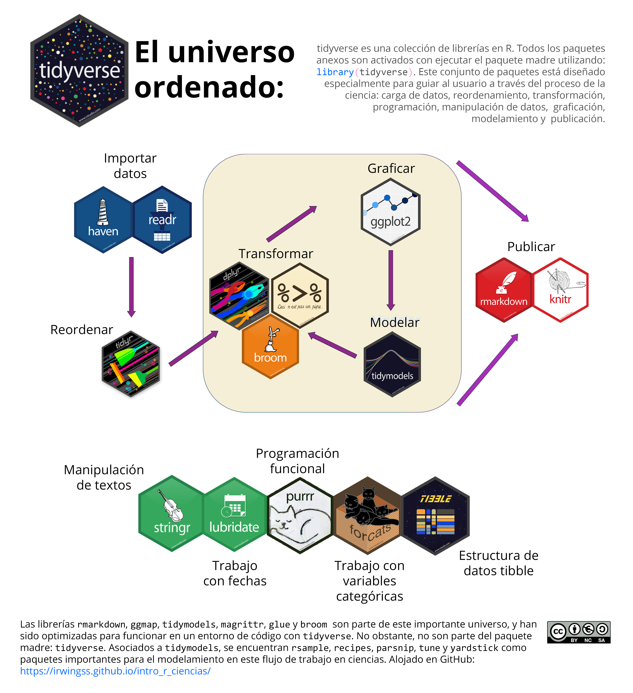
```

<br>

Más allá de los ocho paquetes núcleo de **tidyverse**, se ha desarrollado una gran batería de paquetes asociados, diseñados en el entorno de la sintaxis especial de esta librería. El ecosistema de **tidyverse** incluye librerías para la carga de bases de datos provenientes de softwares estadísticos (e.g., SPSS con **haven**), manejo de variables especiales (e.g., datos de fechas con **lubridate**), modelamiento estadístico (con **tidymodels**) y revisión de modelos (con **broom**). Otros paquetes se han desarrollado para cubrir funciones que interactúen en las pipelines (pipe original `%>%` del paquete **magrittr**), para crear código más legible (e.g., funciones de **rstatix**).

(ref:pipelineejemeplo1) Ejemplo del uso de pipe (`%>%`) en una pipeline para trabajar con tidyverse.

```{r figura50, echo=FALSE, fig.cap='(ref:pipelineejemeplo1)', fig.align='center', out.width="100%"}
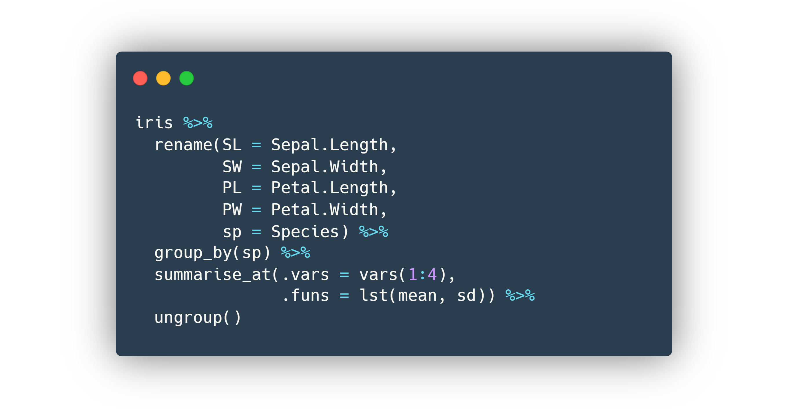
```

#### Activación de **tidyverse** {.unnumbered}

Para instalar **tidyverse** en tu equipo, ejecuta:

```{r, eval=FALSE}
install.packages("tidyverse")
```

Para activar **tidyverse**, ejecuta:

```{r, eval=FALSE}
library(tidyverse)
```

#### Resolver conflictos {.unnumbered}

Tras activar **tidyverse**, aparecerán en la consola los paquetes nucleo que estan siendo activados (**Attaching packages**) y los conflictos que tienen con otras librerías (**Conflicts**) (Figura \@ref(fig:conflictotidyverse)). Un **conflicto** significa que dentro de la librería activada (**tidyverse** en este caso) existen una o más funciones que tienen el mismo nombre que una función alojada en otra librería actualmente activa en la sesión de RStudio. El texto `dplyr::filter() masks stats::filter()` indica que la función `filter()` de la librería **dplyr** es idéntica en nombre a `filter()` de la librería **stats**.

(ref:conflictostidyverse) Vista previa de los conflictos detectados en consola tras la activación de la librería **tidyverse**.

```{r conflictotidyverse, echo=FALSE, fig.cap='(ref:conflictostidyverse)', fig.align='center', out.width="100%"}
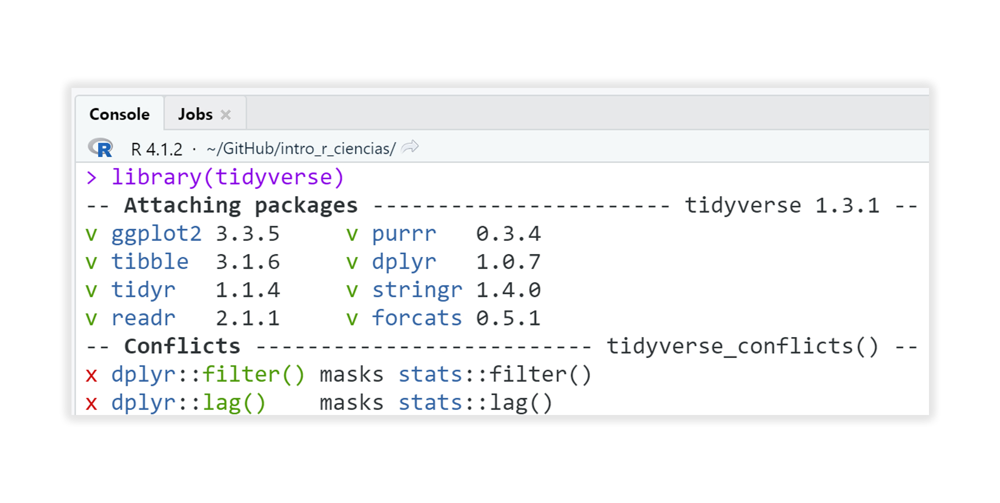
```

Para **resolver el conflicto**, cada vez que se use una función conflictiva se debe especificar la librería de origen con el operador `::`; el código debe ser como el siguiente: `dplyr::filter()`. R reconocerá que se está utilizando la función `filter()` del paquete **dplyr**.

## Datos ordenados (tidy) {#datosordenados}

```{r, eval=FALSE, echo=FALSE}
library(MASS)
data("birthwt")
data("Pima.te")
```

Un gran porcentaje del tiempo que se suele emplear en el análisis de datos en R está dedicado a manipular objetos para su limpieza y preparación. Este lenguaje de programación necesita datos ordenados (del inglés **tidy**) para que su sintaxis de código funcione sin errores. Para R, datos ordenados implica tener objetos tabulares (2D) en los que:

-   Cada fila contenga información de una sola observación o unidad muestral (e.g., parcela, punto, transecto, paciente, placa, o el nombre que reciba su unidad muestral).
-   Cada columnas contenga una única variable de medición y esta sea independiente de las demás.

(ref:tidy1) Datos ordenados correctamente para analizar en R

```{r figura51, echo=FALSE, fig.cap='(ref:tidy1)', fig.align='center', out.width="100%"}
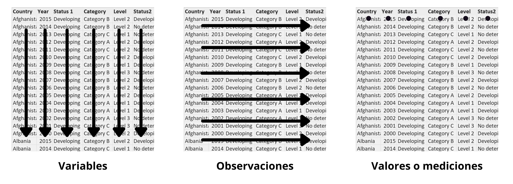
```

El estructurar las bases de datos de esta manera se puede hacer fuera del entorno de R, utilizando el gestor de hojas de cálculo de tu preferencia.

### ¿Qué evitar para tener datos tidy?

En principio, recordando que cada columna es una variable en las que cada fila solo podrá tener un solo valor, se deben evitar las siguientes situaciones:

(ref:excel1) Evitar poner encabezados (texto en negritas), comentarios o usar columnas que no contengan datos (texto resaltado). Celdas fusionadas (texto en rojo) generan problemas porque al cargarse en RStudio, las celdas se desagregan y dejan espacios en blanco.

```{r figura52, echo=FALSE, fig.cap='(ref:excel1)', fig.align='center', out.width="100%"}
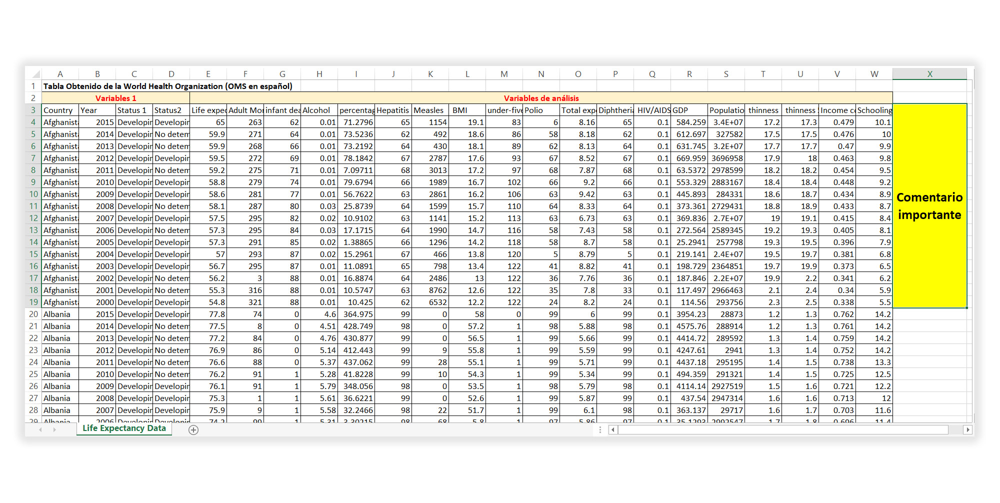
```

(ref:excel2) Evitar colocar más de una variable de medición en una columna. En este caso, la columna `Status` contiene información de estado, categoría y nivel. Estas deben ser tratadas como variables independientes unas de otras.

```{r figura53, echo=FALSE, fig.cap='(ref:excel2)', fig.align='center', out.width="100%"}
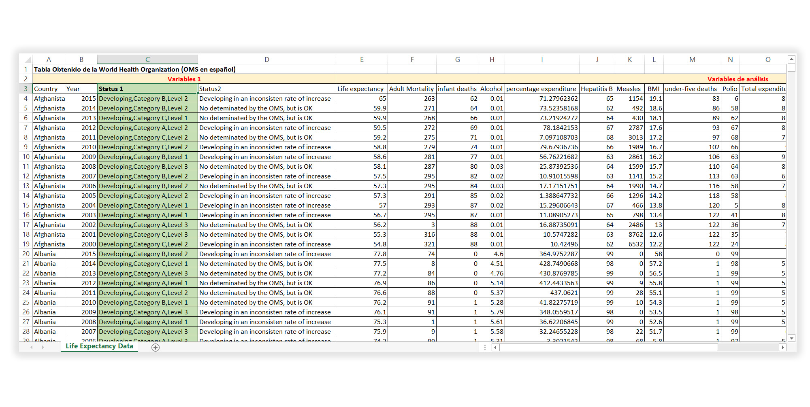
```

(ref:excel3) Evitar nombres complejos como nombre de variable (columna). Al cargar en R, dependiendo de la función, los espacios en blanco entre palabras se autocorregirán por `.` o `_`. Es mejor modificar estos nombres para simplificarlos, acortarlos y evitar espacios en blanco.

```{r figura54, echo=FALSE, fig.cap='(ref:excel3)', fig.align='center', out.width="100%"}
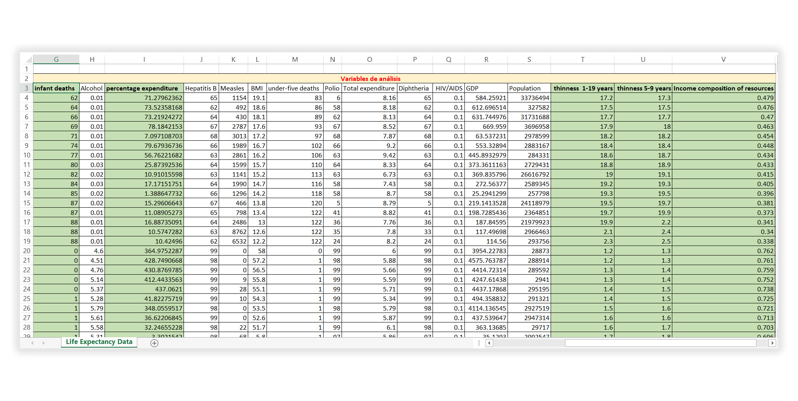
```

(ref:excel4) Si una variable contiene categorías, es probable que en R la quieras tratar como factor para análisis o graficación. Evita nombres de categorías excesivamente largos o con símbolos extraños. Puedes asegurarte en convertirlos a categorías numéricas (1, 2, 3, etc.).

```{r figura55, echo=FALSE, fig.cap='(ref:excel4)', fig.align='center', out.width="100%"}
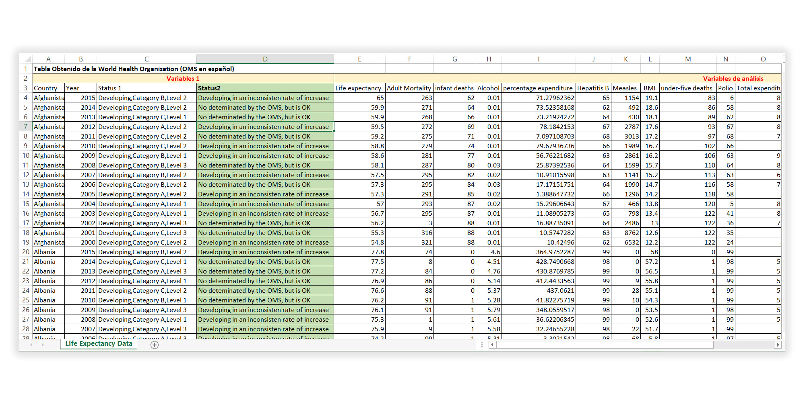
```

Como dato adicional. Trata de utilizar una sola hoja de cálculo por archivo. Facilitará la carga de datos.

### ¿Cómo se debe ver una base tidy?

Con todas las consideraciones mencionadas, una base de datos perfectamente tidy se vería:

(ref:excel5) Tabla de datos ordenada. Vista de hoja de cálculo.

```{r figura56, echo=FALSE, fig.cap='(ref:excel5)', fig.align='center', out.width="100%"}
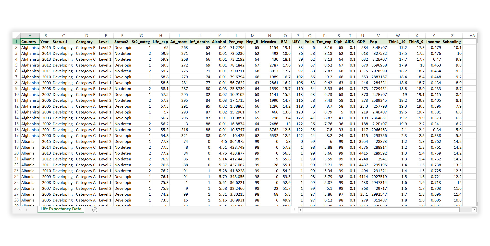
```

Asumiendo que se está utilizando proyectos de RStudio, y que la base de datos `WHO_tidy.xlsx` existe dentro de dicha carpeta, el código para cargar la base datos en R es:

```{r, eval=FALSE}
WHO <- openxlsx::read.xlsx("WHO_tidy.xlsx")
```

(ref:excel6) Tabla perfectamente ordenada vista en RStudio.

```{r figura57, echo=FALSE, fig.cap='(ref:excel6)', fig.align='center', out.width="100%"}
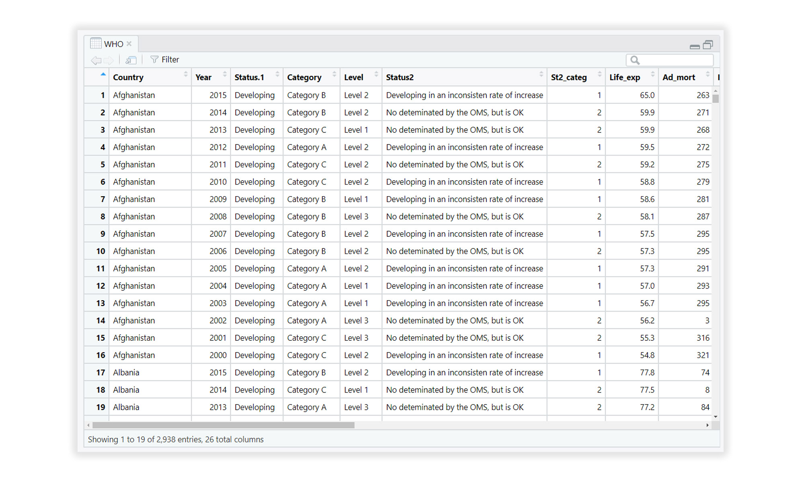
```

```{r, echo=FALSE}
WHO <- openxlsx::read.xlsx("bases/WHO_tidy.xlsx")
```

## Introducción a `dplyr` y `tidyr`

En el universo de **tidyverse** existen dos asombrosa librerías para realizar limpieza y manejo de datos: `dplyr` y `tidyr`. De manera sencilla, las funciones más útiles que contienen son:

```{r, echo=FALSE}
openxlsx::read.xlsx("bases/tabla8.xlsx")%>% 
  kable(format = "pandoc", position = "h!", caption = 'Funciones útiles para la limpieza y manejo de datos con **tidyr**.')
```

```{r, echo=FALSE}
openxlsx::read.xlsx("bases/tabla9.xlsx")%>% 
  kable(format = "pandoc", position = "h!", caption = 'Funciones útiles para la limpieza y manejo de datos con **dplyr**.')
```

## Pipelines con tidyverse

Cuando se inicia en el lenguaje de R, la manera intuitiva de aplicar secuencialmente varias funciones a una base de datos puede lucir así:

```{r, eval=FALSE}
Res1 <- Funcion1(BASE_DE_DATOS)
Res1 <- Funcion2(Res1)
Res3 <- Funcion3(Res2)
```

Pero existe un concepto para explorar en este contexto: anidar variables. Implica colocar funciones una dentro de otra de manera que la aplicación se hace de adentro hacia afuera: sobre `BASE_DE_DATOS` se aplicará `Funcion1()`; al resultado de ella, se aplicará `Funcion2()`; y al siguiente resultado, `Funcion3()`.

```{r, eval=FALSE}
Funcion3(Funcion2(Funcion1(BASE_DE_DATOS)))
```

Los programadores de la librería **magrittr** diseñaron un operador llamado *pipe*, en Español tubo, `%>%`. Este permite ir pasando el resultado de una función como primer argumento (o argumento de `data`) de la siguiente función. Este sencillo operador mejora enormemente la lectura y compresión del código, haciéndolo incluso más elegante. Con *pipe*, el ejemplo secuencial explicado arriba se convierte en:

```{r, eval=FALSE}
# Pipeline
BASE_DE_DATOS %>% 
  Funcion1() %>% 
  Funcion2() %>% 
  Funcion3()
```

La gran ventaja es que **tidyverse** ha sido diseñado en torno a la creación de *pipelines*, en Español tuberías. Siendo que todo se simplifica para su uso con estas librerías y otras que sean consideradas *pipe-friendly*, como **rstatix**. A lo largo del capítulo, se irá aplicando el concepto de tuberías para que te familiarices con su uso.

Como un ejemplo definitivo, así es como se crean *pipelines* que generen gráficos con **ggplot2** y **dplyr**:

```{r, echo=FALSE}
colorPal <- c("#8BC73D","#077173","#5CCAE2","#F2CD00","#CD001A","#5E36CC")
```

```{r figura58, fig.align='center', fig.cap="Ejemplo de código con ggplot2 y dplyr utilizando una pipeline.", message=FALSE, warning=FALSE, out.width="100%"}
# Cargar la base de datos Boston
library(MASS)
data("Boston")

# Pipeline
Boston %>% 
  filter(rad %in% 1:3 & zn != 0) %>%
  group_by(tax) %>% 
  summarise(age_promedio = mean(age),
            rad = unique(rad)) %>% 
  mutate(tax = paste0("N_",tax),
         tax = as.factor(tax),
         rad = as.factor(rad)) %>% 
  ggplot(aes(x=reorder(tax, age_promedio), y=age_promedio, fill=rad))+
  geom_bar(stat="identity")+
  geom_text(aes(label=round(age_promedio,2)), color ="white",
            hjust = 1.1)+
  scale_y_discrete(expand = c(0,0,0,10))+
  scale_fill_manual(values = colorPal)+
  labs(x="Nivel de Tax", y="Edad promedio", fill="Grupo",
       title = "Edad promedio por nivel de Tax",
       subtitle = "Datos obtenidos de Boston (1969)")+
  coord_flip()+ 
  theme_minimal()+
  theme(legend.position = "bottom", 
        axis.ticks.length.y = unit(0, "cm"),
        legend.key.height = unit(0.2,"cm"),
        legend.key.width = unit(1.5, "cm"),
        title = element_text(face = 2))
```

## Tablas anchas y largas con tidyr

En general, mucho de lo que se puede hacer en R necesita de tablas anchas. Este es el nombre que reciben las tablas que cumplen con ser *tidy* (ordenadas, revisa la [Sección 6.1 Datos ordenados](#datosordenados)):

-   cada columna es una variable.
-   cada fila es una observación.

(ref:anchasylargas1) Comparativa entre tabla ancha y larga, y las funciones para pasar de una estructura a otra.

```{r figura59, echo=FALSE, fig.cap='(ref:anchasylargas1)', fig.align='center', out.width="100%"}
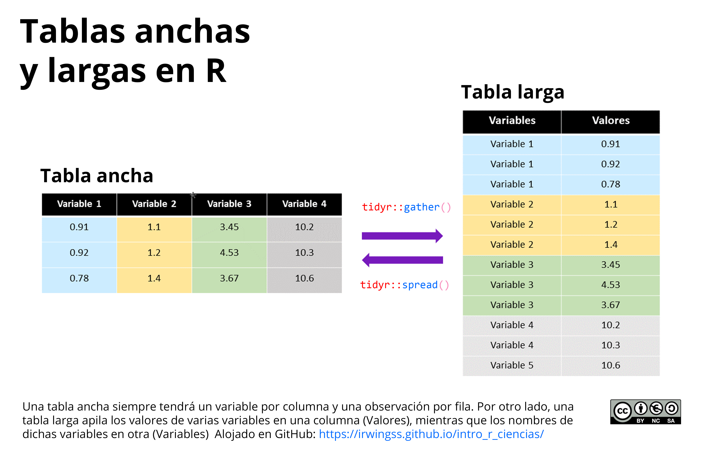
```

### De ancha a larga

En ciertas ocasiones, trabajar con tablas largas es lo que necesitamos para analizar o generar gráficos con los datos. La función `gather()` de la librería **tidyr** permite convertir una tabla ancha en larga, apilando dos o más variables en tan solo dos columnas: una de etiquetas (argumento `key`) y una de valores o contenidos de las celdas (argumento `value`). La estructura básica es:

```{r, eval=FALSE}
gather(DF,             # base de datos
       key = "COL1",   # nombre de la futura columna de etiquetas
       value = "COL2", # nombre de la futura columna de valores
       COL3:COL4)      # columnas a apilar (e.g, posiciones 3:4)
```

::: {.example} 
Considera la tabla `mice2`:

```{r}
# install.packages("datarium")
library(datarium)
data("mice2")

# Ver el contenido
mice2
```

`mice2` es una tabla ancha. Para apilar sus columnas `before` y `after` en una nueva columna llamada `Tiempo`, mientras que sus valores se apilan en `Valores`, se tiene:

```{r}
# Utilizar gather() para apilar las columnas 2 y 3
# en las columnas Tiempo (etiquetas) y Valor (valores)
ratones_larga <- gather(mice2, key="Tiempo", value="Valor", 2:3)

# Ver el contenido
ratones_larga
```
::: 

### De larga a ancha

Apilar variables en tablas largas es muy frecuente en procesos de toma de datos, quizá por facilidad o rapidez en el almacenamiento de los mismos durante los estudios. La función `spread()` permite dispersar datos partiendo de dos columnas: una de etiquetas apiladas (`key`) y otra de valores apilados (`values`), hacia las columnas que sean necesarias (igual a la cantidad de niveles en `key`). La estructura básica es:

```{r, eval=FALSE}
spread(DF,           # base de datos
       key = COL1,   # columna de etiquetas
       value = COL2) # columna de valores
```

::: {.example} 
Considera la tabla `ratones_larga` obtenida en el ejemplo anterior:

```{r}
# Utilizar gather() para apilar las columnas 2 y 3
# en las columnas Tiempo (etiquetas) y Valor (valores)
spread(ratones_larga, key=Tiempo, value=Valor)
```
:::

## Filtrado

Conocer cómo filtrar correctamente una base de datos es fundamental en el manejo de bases de datos. Implica escoger del total de filas solo aquellas que cumplan con ciertos criterios lógicos. 

### Procedimiento de filtrado

**Primer paso:** saber qué se va a filtrar. Por ejemplo: en la base de datos `DF` se desea filtrar solo aquellas filas que en la columna A tengan valores mayores iguales a 5.32. 

**Segundo paso:** formalizar la petición en sintaxis de R, utilizando  operadores lógicos y/o relacionales. Para escribir en R *"todos los valores de un vector A mayor igual a 5.32"*, colocamos:

```{r, eval=FALSE}
A >= 5.32
```

**Tercer paso:** incluir esta petición lógica en la función de filtrado de **dplyr**:

```{r, eval=FALSE}
DF %>% filter(A >= 5.32)
```

### Aplicaciones de filtrado

Considera la base de datos `WHO_tidy.xlsx`:

```{r, echo=FALSE}
WHO <- openxlsx::read.xlsx("bases/WHO_tidy.xlsx")
```

```{r, eval=FALSE}
WHO <- openxlsx::read.xlsx("WHO_tidy.xlsx")
```

::: {.example}
Filtrar únicamente las filas de la categoría `Category B` columna  `Category`.
¿Cuál es el porcentaje de filas que tiene esta nueva base de datos respecto a la original?

```{r}
# Número de filas de WHO
nrow(WHO)

# Filtrado
WHO1 <- WHO %>% filter(Category == "Category B")

# Número de filas de WHO1
nrow(WHO1)

# Porcentaje de filas en WHO1 respecto a WHO
(nrow(WHO1) / nrow(WHO)) * 100
```
:::

Para incorporar más de una condición relacional, utiliza los operadores lógicos "y" `&` u "o" `|`. 

::: {.example}
Filtrar únicamente las filas con cumplan con tener `Category B` en la columna `Category` y Level 1 en la columna `Level`. Calcular el número de filas de la tabla:

```{r}
WHO %>% 
  filter(Category == "Category B" & Level == "Level 1") %>% 
  nrow()
```
:::

Cuando se necesita filtrar más de un nivel para una columna, se utiliza el operador `%in%` (ver [sección 2.3 Operadores lógicos y relacionales](#operadores-lógicos-y-relacionales)). Cuando se deba filtrar todos los niveles excepto uno, es más sencillo el proceso utilizando el operador `!=`.

::: {.example}
Filtrar las categorías `Category A` y `Category B` en la columna `Category`, además de y Level 1 en la columna `Level`. Calcular el número de filas de la tabla:

```{r}
WHO %>% 
  filter(Category %in% c("Category A", "Category B") & Level == "Level 1") %>% 
  nrow()
```
:::

Como era de esperar, ahora hay más filas en la tabla filtrada. 

::: {.example}
Considera adicionar una tercer condición lógica al ejemplo anterior. Esta vez, se requiere filtrar aquellas filas que con valores de expectativa de vida (columna `Life_exp`) mayor a 60:

```{r}
WHO %>% 
  filter(Category %in% c("Category A", "Category B") & Level == "Level 1" & Life_exp > 80) %>% 
  nrow()
```
:::

::: {.example}
Aprovechemos a adicionar una cuarta condición de filtrado: años (columna `Year`) 2013 a 2015.

```{r}
WHO %>% 
  filter(Category %in% c("Category A", "Category B")) %>%  
  filter(Level == "Level 1" & Life_exp > 80) %>% 
  filter(Year %in% 2013:2015) %>% 
  nrow()
```
:::

## Selección

Al igual que con el filtrado de filas, una sola función para seleccionar columnas, `select()`. La función devuelve solo las columnas seleccionadas, ya sea utilizando sus nombres o su indexación de posición. El orden en el que coloques las columnas dentro de la función será el orden en el que aparecerán en el resultado final.

```{block2, type='rmdtip'}
A partir de la reciente versión de R 4.1.3., en algunos equipos es necesario colocar `dplyr::select()` en lugar de simplemente usar `select()`. Si en tu equipo funciona directamente `select()`, no te preocupes en mencionar de qué paquete procede.
```

::: {.example}
Considerando la base de datos `WHO`, seleccionar las columnas `Country`, `Year`, `Polio`, `Diph`, utilizando posición y nombre. Mostrar las primeras 6 filas.

```{r}
# Por posición
WHO %>% 
  dplyr::select(1,2,17,18) %>% 
  head()

# Por nombre
WHO %>% 
  dplyr::select(Country, Year, Polio, Diph) %>% 
  head()
```
:::

Lo más complicado de indexar por posición es justamente saber el número exacto de cada columna. En cualquiera de los casos, revisar los nombres de columnas se puede realizar con `names()`:

```{r}
names(WHO)
```

### Seleccionar con funciones especiales

Para aprovechar al máximo la función `select()`, se puede incluir en ella funciones de selección específicas con funciones de ayuda. 

```{r echo=FALSE, message=FALSE, warning=FALSE}
openxlsx::read.xlsx("bases/tabla10.xlsx")%>% 
   kable(format = "pandoc", caption = 'Funciones de selección específicas utilizando funciones de ayuda')
```
<br>

::: {.example}
Seleccionar todas las columnas que contengan el carácter `_`. Mostrar las primeras 6 filas.

```{r}
WHO %>% 
  dplyr::select(contains("_")) %>% 
  head()
```
:::

La función `num_range("TEXTO", RANGO)` crea un vector de caracteres de la misma manera que lo hace `paste0()`. La diferencia es que `num_range()` solo funciona dentro de `select()`.
```{r}
# Resultado de paste0() idéntico a lo que se obtendría con num_range()
paste0("Status", 1:5)
```

::: {.example}
Seleccionar todas las columnas `Status1` y `Status2` con la función `num_range()`. Mostrar las primeras 6 filas. 

```{r}
# Con num_range()
WHO %>% 
  dplyr::select(num_range("Status", 1:2)) %>% 
  head()

# Con paste0()
WHO %>% 
  dplyr::select(paste0("Status", 1:2)) %>% 
  head()
```
:::

```{block2, type='rmdnote'}
Las dos funciones que se verán a continuación permiten seleccionar utilizando una o varias letras iniciales o finales de cada nombre. La búsqueda no es sensible a si la letra es mayúscula o minúscula.
```

::: {.example}
Seleccionar las columnas **cuyo nombre comience con** la letra S. Mostrar las primeras 6 filas.

```{r}
# Con num_range()
WHO %>% 
  dplyr::select(starts_with("S")) %>% 
  head()
```
:::

::: {.example}
Seleccionar las columnas **cuyo nombre termine con** la letra o. Mostrar las primeras 6 filas. 

```{r}
# Con num_range()
WHO %>% 
  dplyr::select(ends_with("o")) %>% 
  head()
```
:::

## Agrupamiento

La función `group_by()` genera **agrupamientos virtuales**. Divide a una base de datos en función de una columna categórica (factor), pero esta división no se almacena como tal. Si se escogiera como columna de agrupamiento un factor con tres niveles, no esperes ver como resultado tres tablas, cada una con las filas de cada nivel. Este agrupamiento virtual solo permite que las siguientes funciones de la *pipeline* traten por separado a cada nivel.

Esto es muy útil cuando se debe generar resúmenes estadísticos, por ejemplo promedio y desviación estándar, de variables separado por niveles de un factor en la tabla.

En el siguiente ejemplo solo veremos la agrupación, visible como un dato extra mostrado en consola impreso encima la tabla. Más adelante se usará agrupamiento dentro de una *pipeline* más realista.

```{block2, type='rmdwarning'}
Es **importante desagrupar** una vez que se acabaron los cálculos hechos con la pipeline. El no colocar `ungroup()` al final producirá errores cuando más adelante se usa la base de datos resultante en otras *pipelines*. Nunca dejes un `group_by()` sin desagrupar al final.
```

::: {.example}
Seleccionar las columnas `Country`, `Year`, `Polio`, `Diph`, y agrupar la base de datos `WHO` por año (columna `Year`). Mostrar las primeras 6 filas.

```{r}
# Para este ejemplo no usaremos ungroup()
# con la finalidad de mostrar el resultado
# textual que aparece sobre una tabla agrupada
# indicando los grupos >> Groups:   Year [6]
WHO %>% 
  dplyr::select(Country, Year, Polio, Diph) %>%
  group_by(Year) %>% 
  head()
```
:::

```{block2, type='rmdnote'}
Si estas seleccionando y luego agrupando, asegúrate de que la columna de agrupamiento esté dentro de las seleccionadas. La función antagonista de `group_by()` es `ungroup()`.
```

## Conteo

La función de conteo es muy sencilla. Utilizar `count()` brinda el número de veces que cada nivel de una columna del tipo factor aparece en la misma.

::: {.example}
Considerando la base de datos `WHO`, filtrar la base para que aparezcan solo las filas que tengan valores mayor igual a 80 de expectativa de vida (columna `Life_exp`). Realizar un conteo de la veces que cada año (columna `Year`) aparece en la base de datos. Año es una variable numérica de valores enteros, y puede ser tratada como factor.

```{r}
WHO %>% 
  filter(Life_exp >= 80) %>% 
  count(Year)
```
:::

Es notable, ahora, que con el pasar de los años la cantidad de filas con expectativa mayor igual a 80 años ha ido incrementando. Es una respuesta a que la calidad de vida ha mejorado en el mundo.

## Resúmenes estadísticos

Realizar resúmenes estadísticos es uno de los grandes motivos de aprender a trabajar con *pipelines*. Puede aplicarse promedio `mean()`, mediana `median()`, desviación estándar `sd()`, varianza `var()`, suma `sum()`, mínimo `min()`, máximo `max()`, además de cualquier función existente o creada siempre y cuando el resultado de dichas funciones sea un único valor (es decir, un vector de un elemento). 

El resultado final de cualquier función de la familia de `summarise()` es una tabla conteniendo las columnas que se solicitaron como resumen estadístico. La estructura base es:

```{r, eval=FALSE}
BASE_DE_DATOS %>% ... %>% 
  summarise(COLUMNA_NUEVA = FUNCION_ESTADÍSTICA(COLUMNA_ANTIGUA))
```

```{block2, type='rmdtip'}
Las funciones estadísticas como `mean()`, `median()` y las demás mencionadas arriba, tienen problemas lidiando con valores `NA`. Si se calcula el promedio de una columna que se conoce contiene `NA`, se debe colocar el argumento `na.rm = TRUE` dentro de cada función para hacer esta obvie los `NA` y calcule el estimados estadístico deseado. Por ejemplo `mean(vector, na.rm = TRUE)`.
```

<br>

::: {.example} 
Considerando la base de datos `WHO`, calcular el promedio de la columna `Life_exp`, la mediana de la columna `Polio`, y el promedio y desviación estándar de `GDP`. Agrupa previamente por año (columna `Year`). 

```{r}
# Sin consideraro los NA
WHO %>% 
  group_by(Year) %>% 
  summarise(Promed = mean(Life_exp),
            Pol = median(Polio),
            GDP_prom = mean(GDP),
            GDP_sd = sd(GDP)) %>% 
  ungroup()
```

```{r}
# Especificando el argumento na.rm = TRUE 
# para obviar los NA de cada columna
WHO %>% 
  group_by(Year) %>% 
  summarise(Promed = mean(Life_exp, na.rm = TRUE),
            Pol = median(Polio, na.rm = TRUE),
            GDP_prom = mean(GDP, na.rm = TRUE),
            GDP_sd = sd(GDP, na.rm = TRUE)) %>% 
  ungroup()
```
:::

### Otras funciones de la familia `summarise()`

En dplyr existen algunas funciones que tienen versiones similares a ellas. Consideremos esta agrupaciones como familias de funciones. En estas familias, como la de `summarise()`, encontrarás funciones de aplicación específica:

```{r echo=FALSE, message=FALSE, warning=FALSE}
openxlsx::read.xlsx("bases/tabla11.xlsx")%>% 
   kable(format = "pandoc", caption = 'Funciones de la familia `summarise()`')
```

<br>

#### `summarise_all()`

Aplicará la o las funciones especificadas a todas las columnas. Si alguna columna no cumple con lo necesario para se analizada (por ejemplo: intentar obtener el promedio de una columna categórica), se genera error. Asegúrate de que la tabla por completo es analizable, o utiliza la función de **dplyr** `select()` para seleccionar las columnas de trabajo antes de aplicar `summarise_all()`. La estructura básica es:

```{r, eval=FALSE}
BASE_DE_DATOS %>% 
  summarise_all(.funs = lst(LISTA_DE_FUNCIONES))
```

::: {.example #summariseall}
Obtener el promedio, y varianza de las columnas `GDP`, `Life_exp` y `Pop` por país de Colombia, México y Perú (recuerda que la base tiene estos nombres en inglés).

```{r}
WHO %>% 
  filter(Country %in% c("Colombia","Mexico","Peru")) %>% 
  group_by(Country) %>% 
  dplyr::select(GDP, Life_exp, Pop) %>% 
  summarise_all(.funs = lst(mean, var), 
                na.rm=TRUE)%>% 
  ungroup()
```
:::

#### `summarise_at()`

Otra función muy útil al momento de aplicar diferentes funciones estadísticas a varias columnas es `summarise_at()`. Esta función permite seleccionar las columnas de trabajo, como si incorporara su propia función `select()`. La estructura básica es:

```{r, eval=FALSE}
BASE_DE_DATOS %>% 
  summarise_at(.vars = vars(COLUMNAS_DE_TRABAJO),
               .funs = lst(LISTA_DE_FUNCIONES))
```

::: {.example}
Siguiendo el ejemplo \@ref:(exm:summariseall), recrear el resultado utilizando `summarise_at()`:

```{r}
WHO %>% 
  filter(Country %in% c("Colombia","Mexico","Peru")) %>% 
  group_by(Country) %>% 
  summarise_at(.vars = vars(GDP, Life_exp, Pop), 
               .funs = lst(mean, median, sd),  
               na.rm=TRUE)%>% 
  ungroup()
```
:::

#### `summarise_if()`

Aplicar condicionales para seleccionar columnas es muy útil. Esta función permite indicar una condición lógica con funciones de la familia `is()`, como `is.numeric()` que haría la petición de seleccionar solo las funciones numéricas y sobre todas ellas aplicar alguna función estadística. La estructura básica es:

```{r, eval=FALSE}
BASE_DE_DATOS %>% 
  summarise_if(.predicate = FUNCIÓN_IS_SIN_PARÉNTESIS,
               .funs = lst(LISTA_DE_FUNCIONES))
```

::: {.example}
Realizar el promedio y desviación estándar de las columnas numéricas que existan entre las siguientes: `GDP`, `Life_exp`, `Pop`, `Status1`, `Status2`; agrupando por país para Colombia, México y Perú (recuerda que la base tiene estos nombres en inglés):

```{r,eval=FALSE}
WHO %>% 
  filter(Country %in% c("Colombia","Mexico","Peru")) %>% 
  group_by(Country) %>% 
  dplyr::select(GDP, Life_exp, Pop, Status1, Status2) %>% 
  summarise_if(is.numeric, 
               .funs = lst(mean, sd),  
               na.rm=TRUE)%>% 
  ungroup()
```
:::

## Reordenamiento

El concepto detrás de la función `arrange()` es el de brindarle un orden numérico (menor a mayor) o alfabético (A a la Z) a una columna. Si se desea el orden inverso, sea numérico o alfabético, utiliza `arrange(desc())`.

::: {.example}
Filtrar las filas con `GDP` mayor a 70000 y menores de 100000, agrupar por país (columna `Country`) y obtener el promedio y desviación estándar de `GDP`. Reordenar de mayor a menor en base al promedio.

```{r}
WHO %>% 
  filter(GDP >= 70000 & GDP <= 100000) %>% 
  group_by(Country) %>% 
  summarise_at(.vars = vars(GDP), .funs = lst(mean, sd), na.rm = TRUE) %>% 
  arrange(desc(mean))
```
:::

## Creación y transformación de columnas

Las funciones de la familia `mutate()` simplifican enormemente el proceso de crear columnas en la base de datos. Algo muy interesante es que es posible aplicar una transformación a una columna que se está creando o modificando dentro de la misma función de `mutate()` y `transmute()` (revisa la `COL_NUEVA4` en el siguiente código). La estructura base es:

```{r, eval=FALSE}
# Usando mutate()
BASE_DE_DATOS %>% ... %>% 
  mutate(COL_NUEVA1 = FUNCION_DE_TRANSFORMACION(COL_ANTIGUA1),
         COL_NUEVA2 = FUNCION_DE_TRANSFORMACION(COL_ANTIGUA2),
         COL_NUEVA3 = FUNCION_DE_TRANSFORMACION(COL_ANTIGUA3),
         COL_NUEVA4 = FUNCION_DE_TRANSFORMACION(COL_NUEVA1))

# Usando transmute()
BASE_DE_DATOS %>% ... %>% 
  transmute(COL_NUEVA1 = FUNCION_DE_TRANSFORMACION(COL_ANTIGUA1),
         COL_NUEVA2 = FUNCION_DE_TRANSFORMACION(COL_ANTIGUA2),
         COL_NUEVA3 = FUNCION_DE_TRANSFORMACION(COL_ANTIGUA3),
         COL_NUEVA4 = FUNCION_DE_TRANSFORMACION(COL_NUEVA1))
```

```{block2, type='rmdtip'}
El resultado de transformación con `transmute()` es el mismo, excepto que las nuevas columnas aparecerán solitarias en su propia tabla, separadas de la original. Con `mutate()`, las nuevas columnas aparecen adjuntas a la derecha de la última columna dentro de la tabla original.
```

::: {.example #summariseall}
Se pretende ejemplificar un nuevo índice de la relación Poliomielitis - Sarampión utilizando la fórmula:

$$MP = 0.00001*\frac{\sqrt{\text{#Casos de Sarampión}}}{0.39*\text{#Casos de Polio}^2} $$

Crear la nueva columna MP operando las columnas `Measles` para Sarampión y `Polio` para Poliomielitis. Por motivos del ejemplo, seleccionar previamente únicamente las columnas de trabajo, junto con `Country` y `Year` para identificar en qué países y qué años se tuvo un mayor valor del índice. Reordenar la columna `MP` de modo descendente y mostrar las primeras 10 filas.

```{r}
# con mutate()
WHO %>% 
  dplyr::select(Measles, Polio, Country, Year) %>% 
  mutate(MP = (0.00001*(sqrt(Measles) / 0.39 * Polio^2))) %>% 
  arrange(desc(MP)) %>% 
  head(10)

# con transmute(), no es necesario seleccionar 
# debido a que solo se mostrará la columna creada
WHO %>% 
  transmute(MP = (0.00001*(sqrt(Measles) / 0.39 * Polio^2))) %>% 
  arrange(desc(MP)) %>% 
  head(10)
```

:::

```{r echo=FALSE, message=FALSE, warning=FALSE}
openxlsx::read.xlsx("bases/tabla12.xlsx")%>% 
   kable(format = "pandoc", caption = 'Funciones de la familia `mutate()` y `transmute()`')
```

<br>

#### `mutate_all()` y `transmute_all()`

Estas funciones aplicarán las funciones especificadas a todas las columnas de la tabla. Si alguna columna no cumple con lo necesario para se analizada, se genera error. Asegúrate de que la tabla por completo sea modificable con las funciones de transformación definidas. Como alternativa, se utiliza la función de **dplyr** `select()` para seleccionar las columnas de trabajo antes de aplicar `mutate_all()` o `transmute_all()`. La estructura básica es:

```{r, eval=FALSE}
BASE_DE_DATOS %>% 
  mutate_all(.funs = lst(LISTA_DE_FUNCIONES))
```

```{block2, type='rmdnote'}
Si la función a usar en el argumento `.funs =` require más de un argumento para funcionar, es mejor crear una función con todas los argumentos definidos tal y como se necesitan. Luego usa la función nueva dentro de alguna función de la familia `mutate()`.  
```

::: {.example #mutateall}
Seleccionando las columnas `Income`, `GDP` y `Life_exp`, aplicar la función `round()` para redondear a un dígito los decimales de estas columnas. Crea previamente la función `rr()` para redondear a dos decimales un valor dado.

```{r}
# Crear una función de rendondeo a dos decimales
rr <- function(x)round(x,2)

# Aplicar dentro de mutate_all
WHO %>% 
  dplyr::select(Income, GDP, Life_exp) %>% 
  mutate_all(.funs = lst(rr)) %>% 
  head(10)
```
:::

#### `mutate_at()` y `transmute_at()`

Estas funciones permite seleccionar las columnas de trabajo a las cuales se les aplicará algo. La estructura básica es:

```{r, eval=FALSE}
BASE_DE_DATOS %>% 
  mutate_at(.vars = vars(COLUMNAS_DE_TRABAJO),
            .funs = lst(LISTA_DE_FUNCIONES))

BASE_DE_DATOS %>% 
  transmute_at(.vars = vars(COLUMNAS_DE_TRABAJO),
            .funs = lst(LISTA_DE_FUNCIONES))
```

::: {.example}
Siguiendo el ejemplo \@ref:(exm:mutateall), recrear el resultado utilizando `mutate_at()`. Si se utiliza `mutate_at()` con toda la tabla, el resultado será la misma base de datos más las nuevas columnas transformadas. Para no imprimir tanta información, utiliza `transmute_at()`

```{r}
# Crear una función de rendondeo a dos decimales
rr <- function(x)round(x,2)

# Aplicar dentro de mutate_all
WHO %>% 
  transmute_at(.vars = vars(Income, GDP, Life_exp),
            .funs = lst(rr)) %>% 
  head(10)
```
:::

#### `mutate_if()` y `transmute_if()`

Como otras funciones nombradas como `_if`, estas permiten indicar una condición lógica para seleccionar solo las columnas que cumplan con dicha condición. Para establecer la condición se utiliza funciones de la familia `is()`, como `is.numeric()`. La estructura básica es:

```{r, eval=FALSE}
BASE_DE_DATOS %>% 
  mutate_if(.predicate = FUNCIÓN_IS_SIN_PARÉNTESIS,
               .funs = lst(LISTA_DE_FUNCIONES))

BASE_DE_DATOS %>% 
  transmute_if(.predicate = FUNCIÓN_IS_SIN_PARÉNTESIS,
               .funs = lst(LISTA_DE_FUNCIONES))
```

::: {.example}
Aplicar la transformación a factor de las columnas del tipo carácter:

```{r,eval=FALSE}
# Revisar la estructura de WHO
# Notar las columnas chr
str(WHO)

# Utilizar mutate_if()
WHO2 <- WHO %>% 
  mutate_if(is.character, as.factor)

# Revisar la estructura de WHO2
# Notar que las columnas chr cambiaron a Factor 
str(WHO2)
```
:::

## Combinar bases de datos

Combinar bases de datos es una tarea recurrente en ciencia de datos. Las funciones de combinación de **dplyr** utilizan como materia prima data frames o tibbles. La mejor manera de explicar el uso de estas intrincadas funciones es a través de un gráfico. La Figura \@ref(fig:figura60) muestra el detalle de las filas esperadas como resultado del uso de las funciones de combinación:

(ref:combina1) Funciones de combinación de **dplyr** y resultado esperado. El color indica la base de datos de origen de las filas que aparecerán en la tabla de resultados. 

```{r figura60, echo=FALSE, fig.cap='(ref:combina1)', fig.align='center', out.width="100%"}
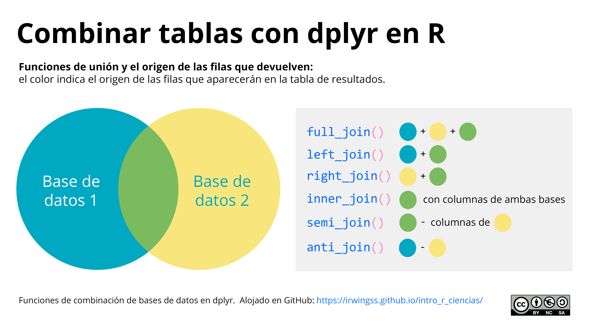
```

Veamos la aplicación de estas funciones con un ejemplo muy simple.

::: {.example}
Considera las data frame `Base_A` y `Base_B`:

```{r}
# Crear las bases de datos
Base_A <- data.frame(ID = LETTERS[1:4],
                     COL1 = 1:4)
Base_B <- data.frame(ID = LETTERS[c(1,3,4,5)],
                     COL2 = c(T,T,F,F))

# Revisar las bases de datos
Base_A

Base_B
```
:::

### `full_join()`

Une las dos bases de datos por completo. Las celdas en blanco que puedan aparecer se rellenan con `NA`.

```{r}
full_join(Base_A, Base_B, by="ID")
```

### `left_join()`

Devuelve todas las filas de `Base_A` y cualquier fila coincidente de  `Base_B`. Las filas exclusivas de `Base_B` no aparecen. Las celdas en blanco que puedan aparecer se rellenan con `NA`.

```{r}
left_join(Base_A, Base_B, by="ID")
```

### `right_join()`

Devuelve todas las filas de `Base_B` y cualquier fila coincidente de  `Base_A`. Las filas exclusivas de `Base_A` no aparecen. Las celdas en blanco que puedan aparecer se rellenan con `NA`.

```{r}
right_join(Base_A, Base_B, by="ID")
```

### `inner_join()`

Devuelve todas las filas coincidentes de `Base_A` y `Base_B`, y muestra las columnas de ambas bases de datos.

```{r}
inner_join(Base_A, Base_B, by="ID")
```

### `semi_join()`

Devuelve todas las filas coincidentes de `Base_A` y `Base_B`, y muestra únicamente las columnas de la `Base_A`.

```{r}
semi_join(Base_A, Base_B, by="ID")
```

### `anti_join()`

Devuelve solo las filas que son exclusivas de `Base_A`.

```{r}
anti_join(Base_A, Base_B, by="ID")
```

## Limpieza de datos

Esta sección abordará algunos tópicos de limpieza de datos o *Data cleaning*. Como ya se ha revisado, los valores perdidos o `NA` causan problemas en el cálculo de parámetros estadísticos de las bases de datos. Más aún, cuando se pretende modelar la relación de una variable Y con los valores de una variable X, es imposible hacer regresión alguna con valores perdidos. Para estos casos, limpiar la base de datos será crucial. 

```{block2, type='rmdnote'}
Siempre que necesites identificar si un elemento dentro de un objeto es `NA` o no, podrás utilizar la función `is.na()`. Esta devolverá un objeto lógico con la misma extensión que el objeto original. En aquellas posiciones donde exista un `NA` en la base de datos original, `is.na()` mostrará `TRUE`.
```

### ¿Cuántos NA existen en la base de datos?

::: {.example}
Considerando la base de datos `WHO`, calcular la cantidad de NA de la base.

```{r}
# Convertir WHO a tabla lógica 
# para ubicar con TRUE a los NA
WHO_logical <- is.na(WHO)
```

Recuerda que para las funciones estadísticas y matemáticas, como `mean()` o `sum()`, `TRUE` equivale a 1 y  `FALSE` a 0. Se puede obtener la proporción de `TRUE` de un vector con `mean()`, o la suma de `TRUE` en el vector con `sum()`. 

```{r}
# Sumando todos los TRUE (equivalentes a 1)
sum(WHO_logical)
```
:::

### ¿Cuántos NA existen en cada columna?

Hay muchas maneras de llegar a este resultado. Pero el procedimiento es similar en concepto al anterior. Se deben sumar los `TRUE` (celdas con `NA`) pero esta vez columna a columna. Como dato adicional, este objetivo también puede conseguir utilizando la función `apply()` ([Sección 5.4 Familia apply()](#familia-apply)).

::: {.example}
Crear una función que sume los NA de un vector:
```{r}
fun_na <- function(x) sum(is.na(x))
```

Ahora, utilizar la función aplicada a todas las columnas de la base de datos `WHO`:

```{r}
WHO %>% 
  summarise_all(.funs = fun_na)
```

Si son demasiadas columnas para visualizar, considera seleccionar las columnas cuyos valores sean mayores de 0. Crea una función que evalúe un valor y otorgue `TRUE` si este es mayor que 0.

```{r}
# Crear la función 
fun0 <- function(x) x > 0
```

La selección ahora utiliza una función que no se utilizó antes: `select_if()`. Como todas las funciones `_if` de **dplyr**, esta necesita condicionales para función. Allí entra en juego la función antes creada:

```{r}
# Aplicarla en select_if()
WHO %>% 
  summarise_all(.funs = fun_na) %>% 
  select_if(fun0)
```
:::

### ¿En qué fila o columna están los NA?

Ubicar la posición de fila y columna de los valores `NA` (celdas en blanco) se utiliza cuando se conoce que no deberían haber celdas vacías pero las hay. Encontrarlas permite rellenar dicho valor por el correspondiente que fue omitido en el proceso de rellenado de la base de datos.

::: {.example}
Ubicar los valores NA de la base de datos WHO. Mostrar únicamente las 10 primeras del resultado:

```{r}
which(WHO_logical, arr.ind=TRUE) %>% 
  head(10)
```
:::

```{block2, type='rmdtip'}
En inglés, *row* significa fila y *col* columna.
```

### ¿Cómo reemplazar los NA por otro valor?

En ocasiones se necesita reemplazar los NA por algún valor por defecto que en el análisis sea útil. Por ejemplo, en bases que representan datos SIG (Sistemas de Información Geográficas), algunas celdas necesitan ser 9999, o -256, o algún otro valor, para que el análisis los considere bajo la categoría "no hay dato". Otros estudios, por su parte, utilizan el rellenar los datos con el promedio o la mediana de la columna. En los siguientes ejemplos veremos su aplicación:

::: {.example #na11}
Rellenar los valores `NA` de la base de datos `WHO` con el valor 9999999. Es excesivamente largo solo con la finalidad de hacerlo notorio, no por otra razón. Selecciona previamente las columnas `Alcohol`, `Hep_B`, `Measles`, `Polio`, `Diph` para que el resultado no sea amplio en la consola. Reordenar el resultado por la columna Alcohol y mostrar las últimas 6 filas de la tabla.

Aquí el truco está en una forma especial de `mutate_all()` para transformar todas las columnas pero utilizando `~ifelse()` para reemplazar todas la `NA` (`is.na(.x)`) por 9999999, y las no `NA` con el mismo valor original (`.x`):

```{r}
WHO %>% 
  dplyr::select(Alcohol, Hep_B, Measles, Polio, Diph) %>% 
  arrange(Alcohol) %>% 
  mutate_all(~ifelse(is.na(.x), 9999999, .x)) %>% 
  tail() 
```
:::

::: {.example}
Considera el mismo ejemplo anterior \@ref(exm:na11). No obstante, en lugar de reemplazar `NA` por 9999999, utiliza la función con `mean(.x, na.rm = TRUE)` para que los NA se reemplacen por el promedio de la columna.

```{r}
WHO %>% 
  dplyr::select(Alcohol, Hep_B, Measles, Polio, Diph) %>% 
  arrange(Alcohol) %>% 
  mutate_all(~ifelse(is.na(.x), mean(.x, na.rm = TRUE), .x))%>% 
  tail() 
```
:::


## Ejercicios del capítulo

```{r}
borrarCol <- function(x) x <- NULL
WHO %>% 
  mutate_if(is.numeric,borrarCol)
```

:::
