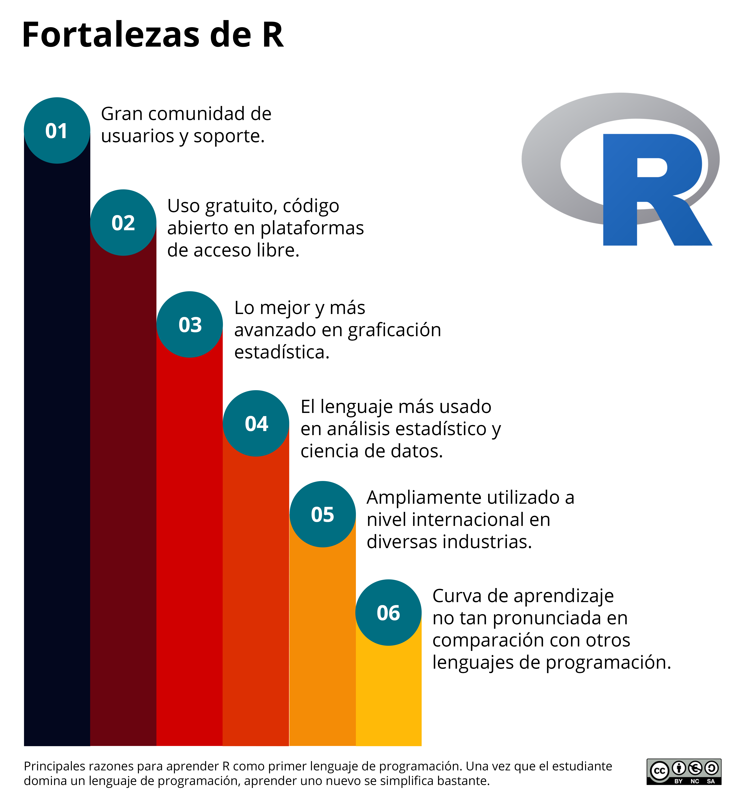

```{r setup, include=FALSE}
library(tidyverse)
library(knitr) 
library(kableExtra)
knitr::opts_chunk$set(echo = TRUE)
bookdown::gitbook(split_by = "section")
```

# **Bienvenida** {.unnumbered}

<a href="https://www.brackinstitute.com"></a>

<br> Esta es la página web del libro *Introducción a R para Ciencias*, publicado por [IC Press](https://www.brackinstitute.com/editorial), Fondo Editorial del Instituto de Ciencias Antonio Brack. Para solicitar una copia electrónica del libro en formato PDF, hacerlo a través de [Amazon](https://www.amazon.com/) o [IC PRESS](https://www.brackinstitute.com/editorial).

Este libro busca:

-   Democratizar el uso del lenguaje de programación R en investigación científica, a través de una explicación amigable, con ejemplos sencillos y ejercicios de refuerzo.

-   Ser el libro de referencia de los primeros módulos del programa *Data Science: Análisis Estadístico para Ciencias con R*, el cual contiene cinco cursos dictados por el profesor [Irwing S. saldaña](https://scholar.google.com/citations?user=ZvRX_U0AAAAJ) en el [Instituto de Ciencias Antonio Brack](https://www.brackinstitute.com/) a través de la plataforma educativa online [masterX](https://www.masterx.org/).

En tal sentido, para usar este libro, no se necesita saber de antemano el lenguaje de programación R ni conocimientos estadísticos.

Este libro ha sido completamente escrito en [R Markdown](https://bookdown.org/yihui/rmarkdown/), utilizando [RStudio](https://www.rstudio.com/). Si tienes alguna sugerencia, o detectas algún fallo ortográfico, error de forma o de fondo, por favor envía un mensaje a `isaldanau@gmail.com` con el asunto de correo "Corrección Libro Estadística".

Esta página web es de *libre uso dentro de los términos autorizados* bajo la [Licencia Internacional Reconocimiento No Comercial - Sin Derivadas 4.0](https://creativecommons.org/licenses/by-nc-nd/4.0/legalcode). Además, esta obra utiliza un [Código de conducta para colaboradores](https://www.contributor-covenant.org/version/2/0/code_of_conduct/). Al contribuir a este libro, acepta cumplir sus términos. Finalmente, esta obra está alojada en [Netlify](https://www.netlify.com), con código abierto disponible en la cuenta de [Github](https://github.com/irwingss/) del autor.

> La **portada del libro** ha sido creada utilizando una fotografía de acceso abierto de <a href="https://unsplash.com/@pawel_czerwinski?utm_source=unsplash&utm_medium=referral&utm_content=creditCopyText">Pawel Czerwinski</a> publicada en <a href="https://unsplash.com/s/photos/abstract?utm_source=unsplash&utm_medium=referral&utm_content=creditCopyText">Unsplash</a>.

## ¿Cómo usar el libro? {.unnumbered}

El libro cuenta con capítulos secuenciales. Si es tu primera vez con R, se sugiere continuar la secuencia. La información está organizada de manera que permita al lector identificar la teoría y ejemplos, junto con ciertos contenidos resaltados como se muestra a continuación:

```{block2, type='rmdnote'}
**NOTAS SOBRE EL CÓDIGO:** brindan ayuda respecto al código. Incluye comandos adicionales, sugerencias o alternativas para escribir de manera más sencilla y clara en el lenguaje R.
```

```{block2, type='rmdtip'}
**COMENTARIOS:** con aclaraciones y mensajes que ayudarán a entender mejor lo explicado.
```

```{block2, type='rmdwarning'}
**ADVERTENCIAS:** de índole metodológica, técnica, o sobre alguna particularidad del código.
```

# **Prefacio** {.unnumbered}

## ¿Por qué aprender R? {.unnumbered}

Sin importar tu carrera de origen, es más que seguro nunca pensaste que algún día terminarías queriendo aprender a programar. Esta necesidad se está haciendo cada vez más frecuentes entre profesionales de distintas ramas de la ciencia. Las razones de aprender a programar pueden ser diversas, pero casi siempre se centran en la necesidad de analizar datos, hacer ciencia, participar en un grupo de investigación, o para tener herramientas analíticas para el doctorado. Pero ¿Por qué R?.

(ref:porquer1) Fortalezas que presenta el lenguaje de programación R y lo destacan por sobre otros lenguajes como Python o Julia.

```{r, echo=FALSE, fig.cap='(ref:porquer1)', fig.align='center', out.width="100%"}

```

R es uno de los lenguajes más populares para ciencia de datos e investigación científica. Es considerado uno de los lenguajes de programación más sencillos de aprender. Tres razones técnicas por las cuales aprender R por sobre otros lenguajes implican:

-   Estuvo orientado al desarrollo estadístico desde su concepción. Casi cualquier análisis puede ejecutarse con él.

-   No necesita compilarse para interpretarse. Es suficiente con usar un interprete como RStudio para que las órdenes se ejecuten.

-   Una de las particularidades del lenguajes que es basado en vectores. Esto simplifica el uso de funciones hacia conjuntos de datos, haciendo del lenguaje rápido en procesamientos básicos.

-   Su amplia comunidad de desarrollo genera constantemente paquetes, manteniendo a los usuarios en la vanguardia del avance científico.

-   Cuenta con una comunidad de soporte enorme en plataformas como [StackOverflow](https://stackoverflow.com/), [RStudio Community](https://community.rstudio.com/), [R-Bloggers](https://www.r-bloggers.com/).

-   Masiva cantidad de repositorios en la nube como [GitHub](https://github.com/), [GitLab](https://gitlab.com/) o [Bioconductor](https://www.bioconductor.org/) donde se alberga toda la información que ha sido alguna vez creada y publicada con R.

## ¿A quién está dirigido este libro? {.unnumbered}

El libro está planeado para llevarte desde cero en el manejo del lenguaje de programación R, sin importar el campo de la ciencia del que provengas. Los capítulos están diseñados para ser independientes entre sí. Siéntete libre de saltar entre los capítulos y seleccionar aquellos que sean de tu interés en el momento, si es que ya dominas conceptos más básicos.

La progresión temática está adaptada a los primeros dos cursos del programa [Data Science: Estadística y Análisis de Datos en R](https://www.masterx.org/bundles/estadisticar), ofrecido por el autor de este libro [Irwing S. Saldaña](https://github.com/irwingss), [Instituto de Ciencias Antonio Brack](https://www.brackinstitute.com/):

- [Introducción a R para Ciencias](https://www.masterx.org/courses/introduccion-a-r-para-ciencias221)
- [Gráficos estadísticos avanzados con R](https://www.masterx.org/courses/graficosggplot2-221)

El programa comenzó a ser dictado en 2020, y ha recibido a estudiantes de diferentes partes de América Latina, El Caribe, y países como Estados Unidos o España. Nuestros alumnos cuentan con diversos perfiles profesionales: biólogos, médicos y otros profesionales de la salud, ingenieros, psicólogos, entre otros; además, profesionales de otras ramas no tan afines a las ciencias básicas o aplicada, como economistas, tecnólogos o especialistas en finanzas.

## Agradecimientos {.unnumbered}

[**FALTA**]{style="color:red;"}
