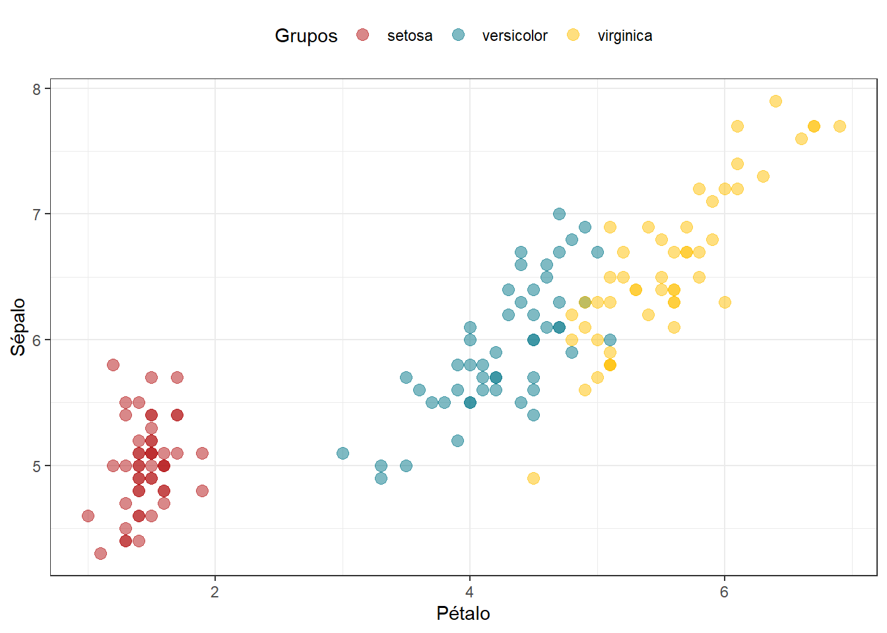

# **Estructuras de datos** {#estructurasdatos}

## **Clasificación de variables**

Toda variable cuenta con dos atributos: clase y estructura. Para entender cómo se almacenan los datos en R, se necesita conocerlas a detalle.

(ref:gatocaja) Analogía del gato en la caja para entender a las variables. Aquí, el gato es el contenido; la caja, la estructura. Esta "variable" puede ser de la clase "contenedora de gatos" y estructura "cartón". Así mismo, habrán variables contenedoras de números, de caracteres, de valores lógicos, y estos estarán ordenados de diferente manera.  

<div class="figure" style="text-align: center">

<p class="caption">(\#fig:unnamed-chunk-1)(ref:gatocaja)</p>
</div>
<br>


### **Clases atómicas**

Según su contenido, en R existen **seis clases básicas (o atómicas) de variables**:

- Clase **lógica:** identificado con el nombre `logical`
- Clase **caracter o texto:** identificado con el nombre `character`
- Clase **número con decimales:** conocidos como _doubles_, identificado con el nombre `numeric`
- Clase **número entero:** identificado con el nombre `integer`
- Clase **número complejo:** identificado con el nombre `complex`
- Clase **crudo o en bits:** identificado con el nombre `raw`

De estos, los últimos tres no serán utilizando a lo largo de este libro. Quizá surja la pregunta de por qué no usar números enteros. En realidad una variable del tipo `numeric` ya incluye enteros y con decimales (es decir, todos los números reales). Para efectos de una gran cantidad de funciones estadísticas, en R no es relevante brindarle números enteros como `integer`, o diferenciarlos de `numeric`.

### **Estructuras de datos** 

Según su estructura, las variables pueden tener una forma de almacenamiento con diferente dimensionalidad. 

- La estructura más básica de R es el **vector**, con una sola dimensión. 
- El vector se convierte en un **factor** si es que contiene información categorizada, y sigue teniendo una dimensión. 
- Si vectores se colocan verticalmente, y se apilan lado a lado, se convierten en una estructura de dos dimensiones. Dependiendo de sus características estas pueden ser: 
**matrices**, **data frames** o **tibbles**.
- Se puede considerar a los **arrays** como arreglos multidimensionales de vectores.
- Finalmente, las _listas_ son estructuras de datos básicas. No se consideran dimensionales dado que almacena a otras estructuras de datos secuencialmente. Una lista puede albergar vectores, factores, matrices, data frames, tibbles, arrays, incluso otras listas.

(ref:strdatos1) Estructuras informáticas para almacenar de datos en el lenguaje R.

<div class="figure" style="text-align: center">

<p class="caption">(\#fig:unnamed-chunk-2)(ref:strdatos1)</p>
</div>

## **Vectores**

R es un lenguaje basado en vectores. La estructura de almacenamiento de datos más básica es el vector. Un vector contiene elementos, que pueden ser números, textos, valores lógicos, y de cualquier clase atómica. No obstante, solamente puede almacenar elementos de una única clase atómica a la vez. Solo números, solo texto, solo valores lógicos.

Para crear un vector, se utiliza la función `c()` donde especifíco los elementos directamente:


```r
# Vector numérico
numeros <- c(1,2,3,4,5,6)
numeros
## [1] 1 2 3 4 5 6
```

Un operador de gran utilidad es `:` que permite crear rangos de números enteros.


```r
1:6
## [1] 1 2 3 4 5 6
```

Además de `c()`, existe la función `vector()` para crear vectores vacíos de una longitud y clase atómica determinado.


```r
# Vector lógico de longitud (length) 10
vLog <- vector("logical", length=10)
vLog
##  [1] FALSE FALSE FALSE FALSE FALSE FALSE FALSE FALSE FALSE FALSE

# Vector de caracteres de longitud (length) 15
vCha <- vector("character", length=15)
vCha
##  [1] "" "" "" "" "" "" "" "" "" "" "" "" "" "" ""

# Vector de números de longitud (length) 20
vNum <- vector("numeric", length=20)
vNum
##  [1] 0 0 0 0 0 0 0 0 0 0 0 0 0 0 0 0 0 0 0 0
```

La razón para usar `vector()` es para crear un _contenedo_ vacío de una longitud determinada, el cual podremos ir llenando con los resultados de un loop. Nos adelantaremos un poco con el código un tanto más avanzado, pero verás el uso de esta función.


```r
vNum <- vector("numeric", length=6)
vNum
## [1] 0 0 0 0 0 0

# Loop donde a una secuencia de números del 1 al 6
# se le multiplica a cada uno por 100
for (i in 1:6){
  vNum[i] <- i * 100
}

# Vector ya rellenado por el loop
vNum
## [1] 100 200 300 400 500 600
```

Otras formas especiales de crear vectores implica el uso de `seq()` para crear secuencias numéricas, o `rep()` para repetir de algún valor una determinada cantidad de veces.

Para crear una secuencia del 10 al 100 cada 5 elementos, se usa el argument `by =` dentro de `seq()`


```r
seq(10, 100, by=5)
##  [1]  10  15  20  25  30  35  40  45  50  55  60  65  70  75  80  85  90  95 100
```

Para crear una secuencia del 36 números entre 10 y 100, se usa el argument `length =` dentro de `seq()`


```r
seq(10, 100, length=36)
##  [1]  10.00  12.57  15.14  17.71  20.29  22.86  25.43  28.00  30.57  33.14  35.71
## [12]  38.29  40.86  43.43  46.00  48.57  51.14  53.71  56.29  58.86  61.43  64.00
## [23]  66.57  69.14  71.71  74.29  76.86  79.43  82.00  84.57  87.14  89.71  92.29
## [34]  94.86  97.43 100.00
```

Las repeticiones implica definir dos argumentos: lo que se repetirá, y la cantidad de veces. Para repetir el carácter `América` 10 veces, se usa:


```r
rep("América", 10)
##  [1] "América" "América" "América" "América" "América" "América" "América" "América"
##  [9] "América" "América"
```

## **Factores**

Los factores son tipos especiales de vectores, donde R evalúa los valores únicos de la secuencia y los define como categorías. Son muy útiles en programación dado que nos permiten graficar, por ejemplo, con un color diferenciado cada nivel de una variable categorica. Imagina que se requiere hacer un gráfico de dispersión de puntos para ver la relación entre dos variables, pero permitiendo que el color de los puntos refleje el grupo al que pertenece cada observación:

(ref:factoresEjemplo) Ejemplo de uso del conjunto de datos _Grupos_ para colorear los puntos del gráfico de enfrentamiento de las variables _Pétalo_ y _Sépalo_.

<div class="figure" style="text-align: center">

<p class="caption">(\#fig:unnamed-chunk-10)(ref:factoresEjemplo)</p>
</div>

Para crear un factor se utiliza la función `factor()`, y un vector dentro de ella. La función evaluará los valores únicos del vector y definirá los niveles del factor:


```r
# Crear un vector de texto cualquiera 
vectorC <- c("A","B","A","A","A","A","B","A","C","C","B")

# Crear un vector de texto cualquiera
vectorN <- c(1,1,2,1,2,2,1,1,2,1,2,1,2,2,2,1)

# Crear factores en base a los vectores
factor(vectorC)
##  [1] A B A A A A B A C C B
## Levels: A B C
factor(vectorN)
##  [1] 1 1 2 1 2 2 1 1 2 1 2 1 2 2 2 1
## Levels: 1 2
```

Cada factor muestra sus niveles (Levels) al final de la secuencia. Se puede conocer cuales son los niveles de un factor guardado en el ambiente, utilizando la función `levels()`:


```r
# Guardar el factor
F1 <- factor(vectorC)

# Revisar los niveles del factor
levels(F1)
## [1] "A" "B" "C"
```

El orden de los niveles es importante. Por defecto se ordenan los niveles de menor a mayor (si son números), o de la A a la Z (sin son texto). Para una regresión, para un gráfico, el orden afecta los resultados. En una regresión lineal, el primer nivel de un factor puede ser considerado como _nivel base_, y las interpretaciones se harán como factores de aumento o disminución de los otros niveles respecto al nivel base. En un gráfico, el orden de los colores, o las etiquetas de un eje, seguirán este orden. 

Para cambiar el orden, las alternativas son variadas. Si solo se desea definir un nivel base, y el orden de los demás niveles no es importante, se usa `relevel()` con el segundo argumento especificando el nivel que será el nuevo nivel base.


```r
# Especificando el primer nivel como "C" 
F1_cambiado <- relevel(F1, "C")
F1_cambiado
##  [1] A B A A A A B A C C B
## Levels: C A B
```

Si se necesita especificar un orden definido manualmente para todos los niveles, es mejor definirlo al momento de crear el factor, usando el argumento `levels=`:


```r
# Crear un factor con niveles ordenados manualmente
F2 <- factor(vectorC, levels=c("B","C","A"))

# Revisar los niveles de F2
levels(F2)
## [1] "B" "C" "A"
```

Por otro lado, si hay necesidad de cambiar el nombre de algún (o algunos) nivel(es), se puede usar un vector con los cambios deseados como contenido del argumento `labels=`. El orden de las etiquetas cambiadas debe seguir el mismo orden original de los niveles:


```r
# Crear un factor con cambie de etiqueta
F3 <- factor(F1, labels=c("Absoluto", "B", "Cambio"))

# Revisar los niveles de F3
levels(F3)
## [1] "Absoluto" "B"        "Cambio"

# Revisando el contenido original (sin cambios) en F1
F1
##  [1] A B A A A A B A C C B
## Levels: A B C

# Revisar el contenido de F3
F3
##  [1] Absoluto B        Absoluto Absoluto Absoluto Absoluto B        Absoluto
##  [9] Cambio   Cambio   B       
## Levels: Absoluto B Cambio
```

Como fue evidente, al crear un factor se puede usar como insumo un vector, como `vectorN`, u otro factor previamente creado, como `F1`.

## **Matrices**

Las matrices son la primera estructura de dos dimensiones aquí presentada. Son útiles cuando se desee aplicar álgebra de matrices. Pero en el día a día, son rudimentarias y limitantes. Sobre esto último, se comporta como un vector: permiten almacenar solamente un tipo de elemento en toda la tabla.

Para crear una matriz, podemos tomar un vector e ir ordenando los elementos de manera vertical u horizontal en una tabla de $n*p$ dimensiones (donde: $n$ es la cantidad de filas y $p$ de columnas), utilizando la función `matrix()`.


```r
# Crear un rango de valores cualquiera
vector1<-1:10
```

Al encajar el contenido del vector de longitud $n$ en forma de matriz (dos dimensiones) sin especificar la cantidad de columnas o filas, crea una matriz de una sola columna con $n$ filas.


```r
matrix(vector1)
##       [,1]
##  [1,]    1
##  [2,]    2
##  [3,]    3
##  [4,]    4
##  [5,]    5
##  [6,]    6
##  [7,]    7
##  [8,]    8
##  [9,]    9
## [10,]   10
```

Para definir la cantidad de columnas y filas se usan los argumentos `ncol=` y `nrow=`, respectivamente:


```r
matrix(vector1, ncol=2, nrow=5)
##      [,1] [,2]
## [1,]    1    6
## [2,]    2    7
## [3,]    3    8
## [4,]    4    9
## [5,]    5   10
```

Por defecto las columnas se llenan _columna por columna_. Para cambiar el comportamiento de llenado a _fila por fila_, se usa:


```r
matrix(vector1, ncol=2, nrow=5, byrow=TRUE)
##      [,1] [,2]
## [1,]    1    2
## [2,]    3    4
## [3,]    5    6
## [4,]    7    8
## [5,]    9   10
```

En este libro no se hace uso extenso de matrices, por lo que no es necesario conocerlas a mayor detalle.

## **Data Frames**

Esta estructura de datos de dos dimensiones es la más parecida a lo que una hoja de cálculo permite: colocar diferentes tipos de elementos dentro de la tabla, como texto, números, elementos lógicos, entre otros. Al cargar en RStudio una base de datos de un estudio, esta se almacenará como data frame casi siempre (cuando no, podrá ser un tibble o una lista).

Para crear data frames manualmente en R, se utiliza la función `data.frame()`, especificando como elementos el contenido de cada columna.


```r
DF <- data.frame(Col1 = 1:5, 
                 Col2 = c("Sit1","Sit1","Sit2","Sit2","Sit3"),
                 Log = c(T,T,F,F,T),
                 Fct = factor(c("A","B","C","B","A")))

DF
##   Col1 Col2   Log Fct
## 1    1 Sit1  TRUE   A
## 2    2 Sit1  TRUE   B
## 3    3 Sit2 FALSE   C
## 4    4 Sit2 FALSE   B
## 5    5 Sit3  TRUE   A
```

Cargar una base de datos de un archivo como data frame en R, dependerá del tipo de archivo

Para cargar un excel, se recomienda usar


## **Tibbles**


## **Listas**


## **Indexación de variables**

### **Indexación en variables 1D**

### **Indexación en variables 2D**

### **Indexación en listas**


## **Coerción de variables**


