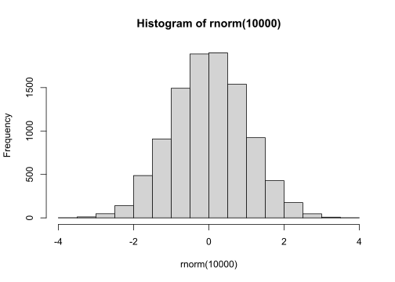

# **Primer contacto con R** {#rbasico}

Este capítulo se centra en el manejo y comprensión del lenguaje de programación R (en adelante: "R") en nivel introductorio. Se asume que el lector tiene instalados y configurados los programas R, RStudio y algún otro programa de soporte para el manejo de paquetes. Si no cuentas con ninguno en tu computadora, visita el capítulo [1 Esenciales de R y RStudio](#esencialesRRStudio).

Una ventaja de los lenguajes de programación es que permiten al usuario definir una secuencia de órdenes (comandos) adaptadas a los requerimientos analíticos que tenga. El flujo de trabajo completo, el paso a paso, queda escrito en el código. Este puede ser compartido con colegas en trabajos colaborativos. 

Antes de aprender sobre los métodos estadísticos de análisis que se revisarán en este libro, se necesita "hablar" correctamente el lenguaje R. Aprenderás a trabajar con el código básico en R, a crear variables para almacenar información, a crear funciones para agilizar el flujo de trabajo, a utilizar `tidyverse` para el manejo y limpieza de bases de datos, entre otros códigos útiles para inicar con R. 

La forma simplificada de cómo funciona R se resume en escribir una orden, presionar "algo" para que la computadora comience a procesar la orden, y luego recibir un resultado textual o gráfico. Básicamente lo que hace cualquier otro lenguaje de programación. 

No obstante, R es considerada una de los mejores lenguajes informáticos si nuestra orientación es más la investigación científica que el desarrollo informático. Otros lenguajes informáticos populares entre científicos son Python, MATLAB, C, C++, JavaScript, SQL, Scala, Julia, SAS, pero ninguno esta tan orientado al desarrollo estadístico como R.

(ref:vistprevRStudio) Ejemplo de uso de RStudio en el análisis estadístico.

<div class="figure" style="text-align: center">

<p class="caption">(\#fig:figura40)(ref:vistprevRStudio)</p>
</div>
<br>

R es considerada como una _calculadora con esteroides_ dado que puedes aplicar matemáticas con él; aquella ciencia sobre la que se cimentan casi todas las demás. Si puedes hacer ello, tienes las puertas abiertas a aplicar análisis estadísticos, generar gráficos y todo lo que te imagines. Y pues sí, también hay cosas algo bizarras en R, como poder crear tu propio [calendario](https://r-coder.com/calendarios-r/) o usar [gatitos](https://github.com/R-CoderDotCom/ggcats) en un gráfico de dispersión de puntos.

A diferencia de los lenguajes humanos (idiomas), un lenguaje de programación debe estar escrito a la perfección. No hay espacio para una coma mal puesta, un paréntesis olvidado, o un nombre errado. La computadora solo ejecutará la orden si todo está escrito exactamente, tal y como debe ser. Todos los ejemplos de este libro pueden ser ejecutados correctamente si se escriben como es mostrado, y si instalaste todo lo necesario para trabajar (revisa las secciones [Prerrequisitos](#prerrequisitos) y [1 Esenciales de R y RStudio](#esencialesRRStudio). 

## Ejecutar código

¿Alguna vez hiciste un histograma de frecuencias?. Hacer uno de manera exploratoria es muy sencillo en R. El siguiente código hará dos cosas en un solo paso: 

1. Creará un conjunto de 10,000 datos aleatorios que siguen en la distribución normal.
2. Generará el gráfico del histograma de frecuencias utilizando el conjunto previamente creado. 

Por ahora no se ahondará en el detalle de qué cosa es `rnorm()` o `hist()`.


```r
hist(rnorm(10000))
```



Para replicarlo, es necesario escribir el código exacto, para luego dar la orden, es decir, ejecutar el código. La ejecución se hace presionando en el teclado de tu computador `control + enter` o `command + enter` (usuarios macOS).

\BeginKnitrBlock{rmdnote}<div class="rmdnote">Existen otros atajos de teclado para ejecuciones especiales.

- Ejecutar todas las líneas de código del script: `control (o command) + shift + enter`.
- Ejecutar desde el inicio del script hasta la línea actual: `control (o command) + Alt + B`.
- Ejecutar desde la línea actual hasta el final del script: `control (o command) + Alt + E`.

No obstante, no son necesarias. Es suficiente con conocer la ejecución básica, dado que para ejecutar varias líneas de código a la vez solo se deben seleccionar las requeridas y ejecutar con  `control + enter` o `command + enter`.</div>\EndKnitrBlock{rmdnote}

Una pregunta que siempre genera confusión es la presencia de unos corchetes `[1]` en los resultados vistos tanto en consola como en este libro. Esto no es parte de un resultado por si mismo, es la posición del elemento mostrado justo a la derecha del corchete. 

Si se ejecuta el símbolo `:` entre dos números, R generará el rango de valores enteros entre dichos números, incluyéndolos.


```r
1:100
#   [1]   1   2   3   4   5   6   7   8   9  10  11  12  13  14  15  16  17  18  19
#  [20]  20  21  22  23  24  25  26  27  28  29  30  31  32  33  34  35  36  37  38
#  [39]  39  40  41  42  43  44  45  46  47  48  49  50  51  52  53  54  55  56  57
#  [58]  58  59  60  61  62  63  64  65  66  67  68  69  70  71  72  73  74  75  76
#  [77]  77  78  79  80  81  82  83  84  85  86  87  88  89  90  91  92  93  94  95
#  [96]  96  97  98  99 100
```

El resultado muestra los confusos `[]` a la izquierda del primer elemento de cada fila del conjunto de datos resultante, indicando su posición dentro de la secuencia de elementos.

## R como calculadora

Como ya se había mencionado antes, R nos permite operar con código. La cosa más sencilla para hacer en R es sumar. 


```r
10 + 10
# [1] 20
```


\BeginKnitrBlock{rstudio-tip}<div class="rstudio-tip">En adelante se visualizará tanto el código a ejecutar (primera línea del ejemplo de suma aquí propuesto) como su resultado textual, mismo que obtendrás en la consola de RStudio (segunda línea del ejemplo) si sigues los pasos de cada ejemplo o ejercicio.</div>\EndKnitrBlock{rstudio-tip}

<br>


Table: (\#tab:unnamed-chunk-5)Operaciones (símbolos) aritméticas en R

Operador   Operación                                 Ejemplo        Resultado
---------  ----------------------------------------  ------------  ----------
`+`        Suma                                      `10 + 3`          13.000
`-`        Resta                                     `10 -  3`          7.000
`*`        Multiplicación                            `10 * 3`          30.000
`/`        División                                  `10 / 3 `          3.333
`^`        Potencia                                  `10 ^ 3 `       1000.000
`%/%`      División entera (parte entera)            `10 %% 3 `         3.000
`%%`       Residuo de dividir un número entre otro   `10 %/% 3 `        1.000

### Funciones matemáticas

Operaciones más complejas necesitan el uso de funciones. Estas son "secuencias de ordenes empaquetadas con un nombre pequeño y recordable" — la información sobre las funciones será desarrollada más adelante ([2.6 Funciones](#funciones) y [6.2 Creación de Funciones](#creacion-fun)). En la siguiente tabla se presentan las funciones matemáticas más comunes en R: 


Table: (\#tab:unnamed-chunk-6)Operaciones matemáticas en R. Estos procedimientos matemáticos vienen predefinidos como ordenes denominadas "Funciones".

Función       Operación                   Ejemplo         Resultado
------------  --------------------------  -------------  ----------
`exp(n)`      Eleva e a la n              `exp(3)`           20.086
`sqrt(n)`     Raíz cuadrada de n          `sqrt(3)`           1.732
`log(n)`      Logaritmo natural de n      `log(3)`            1.099
`log(n, b)`   Logaritmo de n en base b    `log(3, 10)`        0.477
`log10(n)`    Logaritmo de n en base 10   `log10(3)`          0.477
`log1p(n)`    Logaritmo natural de n +1   `log1p(2)`          1.099
`log2(n)`     Logaritmo en base 2         `log2(10)`          3.322
`pi`          Número pi                   `pi`                3.142
`abs(n)`      Convierte n en absoluto     `abs(-10.2)`       10.200

## Operadores lógicos y relacionales

Además de poder operar matemáticamente dos objetos, los lenguajes de programación como R usan condiciones lógicas para definir estados de verdadero (`TRUE`) o falso (`FALSE`). Existen dos tipos de operadores en R para de definir un estado lógico:

Los operadores relacionales permiten comparar dos objetos y definir si la condición solicitada es verdadera o falsa. Por ejemplo: al preguntar a R si 10 es mayor que 9, definirá la condición lógica como verdadera. Este tipo de comparaciones pueden ser mayor, menor, mayor igual, menor igual, igual, no es igual o negación de un valor.

Los operadores lógicos permiten definir una condición lógica en base a los resultados de dos comparativas relacionales. Por ejemplo, si se desea filtrar las filas de una tabla para que se cumpla la _condición 1_: valores mayores a 10 en la columna A _y_ la _condición 2_: valores menores que 5 en la columna B, es preciso que ambas condiciones se cumplan para que una fila se muestre en el resultado final, gracias al operador _y_. Si la condición usa el operador _o_, tanto se cumpla una u otra condición, la fila se mostrará en el filtrado final.

En la siguiente tabla se muestran los operadores lógicos (últimos dos) y relacionales.


Table: (\#tab:unnamed-chunk-7)Operadores relacionales y lógicos en R, modos de uso y resultado lógico esperado (Verdadero o Falso).

Operador     Operación                                                                                                                                  Ejemplo               Resultado 
-----------  -----------------------------------------------------------------------------------------------------------------------------------------  --------------------  ----------
`!a`         `a` no es verdadero (negación de `a`)                                                                                                      `!TRUE`               FALSE     
`==`         `a` es igual `b`, donde `b` es un solo elemento                                                                                            `1 == 2`              FALSE     
`%in%`       `a` es igual `b`, donde `b` es un conjunto de elementos                                                                                    `1 %in% c(2,3,1)`     TRUE      
`!=`         `a` no es igual `b`                                                                                                                        `A != A`              FALSE     
`>`          `a` es mayor que `b`                                                                                                                       `10 > 9`              TRUE      
`<`          `a` es menor que `b`                                                                                                                       `10 < 9`              FALSE     
`>=`         `a` es mayor igual que `b`                                                                                                                 `10 >= 9`             TRUE      
`<=`         `a` es menor igual que `b`                                                                                                                 `10 <= 9`             FALSE     
`|` o `||`   Se cumple la `Condición 1` o `Condición 2`. Si al menos una de las dos condiciones es verdadera, el resultado final es verdadero.          `9 == 10 | 10 > 9`    TRUE      
`&` o `&&`   Se cumple la `Condición 1` y la `Condición 2`. Si ambas condiciones son verdadera, el resultado final es verdadero, de otro modo, falso.   `10 == 10 & 10 > 9`   TRUE      

## Comentar el código

Una forma de asegurar que en el futuro el código escrito sea entendible, incluso por nosotros mismos, es comentándolo. Dejar comentarios nos ayudará a recordar la intención con la que se escribió una sección determinada de los comandos.

Para comentar en R, se requiere colocar el símbolo `#` a la izquierda del texto a ser considerado comentario. 


```r
# Esta es una suma 
2 + 2 
# [1] 4

10 * 2 # + 3029
# [1] 20
```

Como queda en evidencia, no importa si el comentario está en solitario en una línea de código, o si está a la derecha de algo que sí se quiere ejecutar. Esto no afecta el resultado de la operación.

## Creación de variables

Las variables son espacios virtuales, que puede contener de elementos o estar vacíos. Imagina que en una tabla de datos es un objeto "contenedor de mediciones" de un trabajo de investigación. Dicha tabla puede ser considerada una variable u objeto en R. Más adelante se hablará sobre los tipos de variables que existen en R.

Una forma sencilla de comenzar con variables es guardar un valor numérica en la memoria de trabajo de RStudio, también llamado ambiente (pestaña _Environment_). En este sentido, se necesita _asignar_ el contenido a un nombre para que RStudio lo "recuerde", haciendo uso de un operador de asignación `<-`. Para crear una variable llamada NUM conteniendo el número 2022.


```r
NUM <- 2022
```

Si se desea ver el contenido de una variable previamente guardada en el ambiente, basta con ejecutar el nombre d ela variable:


```r
NUM
# [1] 2022
```

o usar la función `print()` para imprimirla en la consola:


```r
print(NUM)
# [1] 2022
```

Una versión frecuentemente usada en ejemplos de R, involucra colocar a la asignación entre paréntesis para que hacer dos cosas a la vez: guardar la variable en el ambiente y mostrar su contenido en la consola.


```r
(NUM <- 2022)
# [1] 2022
```

Existe la posibilidad de asignar con un operador de asignación inverso `->`. Toma en cuenta qué debe ir en la cola (contenido) y en la cabeza (nombre) del operador. En otras palabras, la "flecha" que se forma con este operador siempre apunta al futuro nombre de la variable. Recuerda, la variable no existe hasta que no se ejecute y aparezca dicho nombre en el ambiente de RStudio.


```r
# Operador de asignación inverso
2022 -> NUM
```

El símbolo `=` también funciona, pero, por convención, este no se debe usar para crear variables. Se usará dentro de las funciones para "asignar" contenido a los argumentos de las mismas (se explicará a continuación).


```r
# Mal uso del símbolo =
NUM = 2022

# Buen uso del símbolo = : siempre dentro de una función.
# Calcular el logaritmo en base 2 de 10
bs <- 2 + 8
log(10, base = bs)
# [1] 1
```


\BeginKnitrBlock{rstudio-tip}<div class="rstudio-tip">Ciertamente, en el ejemplo anterior no fue esencial guardar la variable `bs` en el ambiente para su uso posterior dentro de `log()`. Sabemos de antemano que la suma es `10`. No obstante, este ejemplo nos da idea de como aplicar el guardar un resultado para usarlo luego en ejercicios más complejos.</div>\EndKnitrBlock{rstudio-tip}

No es posible continuar hablando de variables sin antes hacer una introducción a las funciones en R. 

## Funciones {#funciones}

Se puede idealizar una función como una secuencia de órdenes (líneas de código) que tienen como objetivo aplicarle un procedimiento (gráfico, estadístico, de modificación o transformación, entre otros) a un objeto de entrada (input) para generar un resultado (ouput). Dichas líneas de código están empaquetadas y almacenadas con un nombre. 

Reconocer una función en R es tarea sencilla, siempre será un nombre seguido de paréntesis. Por ejemplo, la función para calcular la desviación estándar de un conjunto de datos es `sd()`, que proviene del inglés _standard deviation_. Dentro de los paréntesis se deben colocar los argumentos de la función. El argumento más sencillo que algunas funciones necesitan es un conjunto de datos, y es justamente lo único que necesita `sd()`.


```r
# Para crear un conjunto de datos en R se usa la función c()
x <- c(7,9,3,4,5,3,7,8)

# Usando sd() para hallar la desviación estándar de x
sd(x)
# [1] 2.315
```

Si se ejecuta únicamente el nombre de una función existente en RStudio, en la consola se mostrará el contenido de la misma, la secuencia de órdenes que le dan forma a la función. Ejecuta el `sd` para ver su contenido:


```r
sd
# function (x, na.rm = FALSE) 
# sqrt(var(if (is.vector(x) || is.factor(x)) x else as.double(x), 
#     na.rm = na.rm))
# <bytecode: 0x00000000165f9580>
# <environment: namespace:stats>
```

La secuencia de órdenes dentro de `sd` es corta. Básicamente utiliza la función `sqrt()` para sacarle la raíz cuadrada a la función `var()`, esta última calcula la varianza de un conjunto de datos. La estructura del código es propiamente la fórmula matemática para el cálculo de la desviación estándar. Aunque, a decir verdades, el código luce más complejo, y es debido a que aquí la función `var()` contiene argumentos condicionales para pedir que evalúe si el objeto `x` es correcto para la función, o si se necesita un cambio antes de procesar`x` en `sd()`. Pierde cuidado si no se entiende mucho por ahora, no es necesario comprender las funciones a este nivel al iniciar con R.

## Funciones básica útiles

En gran medida, las primeras etapas del aprendizaje de R involucran _entender_, siendo prioritario comprender qué dice un código y cómo se interpreta, más allá de escribirlo de memoria. En este sentido, la mayoría de funciones están nombradas de tal manera que indican para qué se pueden usar. Un dominio básico del idioma inglés será de mucha utilidad, principalmente porque casi todas las funciones de R están nombradas en inglés.

Para facilitar esta primera etapa de aprendizaje, aquí se muestra una lista de funciones básica útiles, tanto a nivel de programación como de análisis de datos, que serán clave para iniciar con R.

Los ejemplos de uso de la tabla son aplicables, siempre y cuando se ejecute antes el siguiente código para activar la base de datos `iris`, y crear los vectores `x`, `y`, y `letras`.


```r
data("iris")
set.seed(123)
x <- rnorm(30,2,1)
y <- rnorm(30,5,3)*x/2
letras <- c("A", "B", "A", "A")
```


Table: (\#tab:unnamed-chunk-19)Funciones básicas útiles en R.

Función                Descripción                                                                                                                                                                                Ejmplo.de.uso                                              
---------------------  -----------------------------------------------------------------------------------------------------------------------------------------------------------------------------------------  -----------------------------------------------------------
`|>`                   Operador pipe nativo.                                                                                                                                                                      `x |> round(2)`                                            
`%>%`                  Operador pipe de tidyverse.                                                                                                                                                                `x %>% round(2)`                                           
`mean()`               Promedio de un conjunto de datos `x`.                                                                                                                                                      `mean(x)`                                                  
`median()`             Mediana de un conjunto de datos `x`.                                                                                                                                                       `median(x)`                                                
`sd()`                 Desviación estándar de un conjunto de datos `x`.                                                                                                                                           `sd(x)`                                                    
`var()`                Varianza de un conjunto de datos `x`.                                                                                                                                                      `var(x)`                                                   
`quantile()`           Cálculo de cuantiles de un conjunto de datos `x`.                                                                                                                                          `quantile(x)`                                              
`range()`              Valor mínimo y máximo de un conjunto de datos `x`.                                                                                                                                         `range(x)`                                                 
`seq_along()`          Crea una secuencia de números enteros desde 1 hasta el valor de la longitud de elementos del vector.                                                                                       `seq_along(x)`                                             
`sum()`                Suma de todos los elementos numéricos de un conjunto de datos `x`.                                                                                                                         `sum(x)`                                                   
`max()`                Valor máximo de un conjunto de datos `x`.                                                                                                                                                  `max(x)`                                                   
`min()`                Valor mínimo de un conjunto de datos `x`.                                                                                                                                                  `min(x)`                                                   
`seq()`                Calcula una secuencia de números al ofrecerle un inicio, un final y cada cuántos valores.                                                                                                  `seq(0, 10, 2)`                                            
`seq()`                Calcula una secuencia de números al ofrecerle un inicio, un final y cada la cantidad de valores que necesito de dicho rango.                                                               `seq(0, 10, length=25)`                                    
`rep()`                Repite un vector una cantidad de veces definida.                                                                                                                                           `rep("Perú", 15)`                                          
`paste0()`             Concatena dos elementos de texto sin espacio entre ellos                                                                                                                                   `paste0("Séptima","Maravilla")`                            
`paste()`              Concatena dos elementos de texto con espacio entre ellos                                                                                                                                   `paste("Séptima","Maravilla")`                             
`sort()`               Reordena un vector de mayor a menor, o alfabéticamente.                                                                                                                                    `sort(c("C","Z","A"))`                                     
`rev()`                Muestra un vector en orden reverso.                                                                                                                                                        `rev(c("C","Z","A"))`                                      
`unique()`             Muestra los valores únicos de un vector `x`.                                                                                                                                               `unique(letras)`                                           
`scale()`              Estandariza (centrado y escalado) un conjunto de datos x.                                                                                                                                  `scale(x)`                                                 
`lm()`                 Calcula un modelo lineal, siguiendo una fórmula predefinida.                                                                                                                               `lm(Petal.Length ~ Sepal.Length, data=iris)`               
`glm()`                Calcula un modelo generalizado lineal, siguiendo una fórmula predefinida.                                                                                                                  `glm(Petal.Length ~ Sepal.Length, data=iris)`              
`aov()`                Calcula un ANOVA, siguiendo una fórmula predefinida.                                                                                                                                       `aov(Petal.Length ~ Species, data=iris)`                   
`summary()`            Ofrece un resumen estadístico de un objeto especial, un vector o una base de datos.                                                                                                        `summary(x)`                                               
`chisq.test()`         Prueba de Chi cuadrado de dos variables.                                                                                                                                                   `chisq.test(x, y)`                                         
`t.test()`             Prueba de T de dos variables.                                                                                                                                                              `t.test(x, y)`                                             
`cor.test()`           Correlación (`pearson`, `kendall`, `spearman`) de dos conjuntos de datos.                                                                                                                  `cor.test(x, y, method="pearson")`                         
`plot()`               Realizá un gráfico de dispersión de puntos entre dos vectores numéricos.                                                                                                                   `plot(x, y)`                                               
`pairs()`              Genera un gráfico de enfrentamientos pareados entre todas las columnas de una base de datos.                                                                                               `pairs(DF)`                                                
`hist()`               Grafica un histograma de frecuencias de un vector `x`.                                                                                                                                     `hist(x)`                                                  
`boxplot()`            Grafica un gráfico de cajas de un vector `x`.                                                                                                                                              `boxplot(x)`                                               
`plot(density())`      Produce el gráfico de función de densidad de un vector `x`.                                                                                                                                `plot(density(x))`                                         
`rnorm()`              Genera una cantidad de números aleatorios que siguen la distribución Normal, con parámetros definidos.                                                                                     `rnorm(100, mean=1, sd=0)`                                 
`set.seed()`           Especifíca que secuencia de números aleatorios usar. Permite replicabilidad de un evento aleatorio.                                                                                        `set.seed(123)`                                            
`getwd()`              Muestra la dirección del directorio de trabajo actual.                                                                                                                                     `getwd()`                                                  
`setwd()`              Define la nueva dirección del directorio de trabajo.                                                                                                                                       `setwd("C:/mi carpeta")`                                   
`str()`                Muestra la estructura de una base de datos.                                                                                                                                                `str(iris)`                                                
`View()`               Visualiza una base de datos en una nueva pestaña.                                                                                                                                          `View(iris)`                                               
`names()`              Reporta los nombres de las columnas de una base de datos.                                                                                                                                  `names(iris)`                                              
`colnames()`           Reporta los nombres de las columnas de una base de datos.                                                                                                                                  `colnames(iris)`                                           
`rownames()`           Reporta los nombres de las filas de una base de datos.                                                                                                                                     `rownames(iris)`                                           
`length()`             Reporta el número de elementos de un vector, o la cantidad de columnas de una base de datos.                                                                                               `length(x)` o `length(iris)`                               
`nrow()`               Reporta la cantidad de filas de una base de datos.                                                                                                                                         `nrow(iris)`                                               
`ncol()`               Reporta la cantidad de columnas de una base de datos.                                                                                                                                      `ncol(iris)`                                               
`head()`               Muestra las primeras 6 filas de una data frame (DF) o tibble.                                                                                                                              `head(DF)`                                                 
`tail()`               Muestra las últimas 6 filas de una data frame (DF) o tibble.                                                                                                                               `tail(DF)`                                                 
`ls()`                 Lista el nombre de todos los objetos en el ambiente.                                                                                                                                       `ls()`                                                     
`rm()`                 Elimina una variable del ambiente de RStudio.                                                                                                                                              `rm(iris)`                                                 
`rm(ls())`             Elimina todas las variables del ambiente de RStudio.                                                                                                                                       `rm(ls())`                                                 
`dev.off()`            Cierra forzadamente la salida gráfica de RStudio. Ejecutar para cuando existe algún error en la generación de un gráfico. Además, permite terminar la exportación de un archivo gráfico.   `dev.off()`                                                
`install.packages()`   Permite instalar una librería en RStudio.                                                                                                                                                  `install.packages("tidyverse")`                            
`library()`            Permite activar durante la sesión actual una librería previamente instalada.                                                                                                               `library(tidyverse)`                                       
`table()`              Muestra la frecuencia de los elementos únicos de un vector.                                                                                                                                `table(letras)`                                            
`subset()`             Devuelve un subgrupo de filas en una base de datos, filtradas si cumplen con una condición lógica.                                                                                         `subset(iris, Petal.Length > 6.5)`                         
`sample()`             Devuelve un muestreo aleatorio de tamaño definido de un conjunto de datos x.                                                                                                               `sample(x, 3)`                                             
`data()`               Permite cargar una base de datos de ejemplo preinstalada en RStudio dentro de algún paquete activo.                                                                                        `data("iris")`                                             
`round()`              Redondea un número a la cantidad de decimales establecida.                                                                                                                                 `round(0.00887, 2)`                                        
`signif()`             Redondea un número a la cantidad de números significativos establecida.                                                                                                                    `signif(0.00887, 2)`                                       
`print()`              Imprime un objeto en la consola. Retorna el valor original..                                                                                                                               `print(x)`                                                 
`return()`             Imprime un objeto en la consola. Retorna el valor original..                                                                                                                               `return(x)`                                                
`cut()`                Convierte a factor un vector, dividiéndolo (cortándolo) en la cantidad de grupos definidos. Clásica función para convertir un vector numérico de edades en rangos etarios.                 `cut(1:20, breaks = 3)`                                    
`cut()`                Los mismo que cut() pero dándole un nombre nuevo a cada nivel del factor.                                                                                                                  `cut(1:20, breaks = 3) |> factor(labels = c("A","B","C"))` 
`print()`              Imprime un objeto en la consola. Retorna el valor original..                                                                                                                               `print(x)`                                                 
`return()`             Imprime un objeto en la consola. Retorna el valor original..                                                                                                                               `return(x)`                                                

## Ejercicios del capítulo

<div class="question">
  1. Soluciona la ecuación $\frac{24+12}{(2 * 3)^2}$.
  1. Resuelve $\mathrm{log_{10}}(|\frac{\mathrm{exp(10)}^2}{-10*9^{6}}|)$. Las barras verticales implican aplicar valor absoluto antes de calcular el logaritmo en base 10.
  1.La función sigmoidal $\sigma(\mathrm{z}) = \frac{1}{1+e^{-\mathrm{z}}}$ es muy importante en estadística. Permite convertir el resultado de una regresión logística (Odds ratios) en probabilidades, facilitando la interpretación. Utiliza la fórmula $z = -1.69 + 1*0.56$, emulando el resultado hipotético de una regresión logística, como insumo para calcular su probabilidad correspondiente utilizando la función sigmoidal. Como dato extra, el resultado de $\sigma(\mathrm{z})$ por 100 para convertirlo a probabilidad porcentual.
  1. Este ejercicio avanzado es de carácter explicativo. Sigue el ejercicio en la sección del [Solucionario: Cap. 2, pregunta 3](#cap.-2-primer-contacto-con-r) correspondiente. Para calcular la derivaba de una función matemática, primero se debe crear la estructura matemática utilizando la función `expression()`. Una vez guardada la expresión, se utiliza la función `D()` para derivar. <br>
  <br>Calcula la primera derivada de:
  <br>$f(x)=-2x+2$
  <br>$f(x)=-2x^2-5$
  <br>$f(x)=\frac{x^3+2}{3}$
  <br>
  <br>
  Calcula la primera derivada de una expresión con dos variables:
  <br>$f(x)=x^2+y^2+2*x*y-3*x+4*y+4$
  <br>
  <br>
  Calcula la segunda derivada de:
  <br>$f(x)=x^2+3*x$
  1. Crea un vector con llamado `num1` conteniendo 1000 números aleatorios con distribución normal, con promedio 19 y desviación estándar 1.29 (revisa la [TABLA 2.4](#funciones-básica-útiles)).
  Asegúrate de ejecutar previamente la función `set.seed(123)` para que el ejercicio sea replicable.
  1. Calcula el promedio y la desviación estándar del objeto `num1`. ¿Son exactamente iguales a los valores definidos con los que creaste el conjunto de datos usando `rnorm()`?
  1. Calcula los cuartiles de dicho conjunto de datos. ¿Cuál es el valor del cuartil 50% (que es conocido como mediana) (revisa la [TABLA 2.4](#funciones-básica-útiles))?
  1. Utilizando los operadores relacionales, convierte el vector numérico `num1` a vector lógico, aplicando la pregunta lógica "números mayores a 20.0". Guarda el resultado en el ambiente con el nombre `VL20` (revisa la [TABLA 2.3](#operadores-lógicos-y-relacionales)).
  1. Coloca el objeto `VL20` dentro de la función `mean()`. La función mean calcula normalmente el promedio de un conjunto de datos numéricos. No obstante, cuando se le ofrece un vector lógico, contabiliza la cantidad de elementos `TRUE` y ofrece la proporción de verdaderos respecto al total de elemento del conjunto. ¿Cuál es la proporción de elementos `FALSE` del vector `VL20`? (revisa la [TABLA 2.3](#operadores-lógicos-y-relacionales)).
  1. Utilizando los operadores lógicos y relacionales, convierte el vector numérico `num1` a vector lógico, aplicando la pregunta lógica "números menor igual a 19.5 y números mayor a 15.7" (revisa la [TABLA 2.3](#operadores-lógicos-y-relacionales)).
</div>

